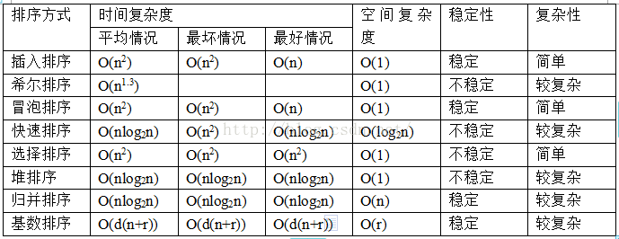

<!-- MarkdownTOC -->

- [算法](#算法)
- [图解算法](#图解算法)
- [刷题遇到的问题](#刷题遇到的问题)
	+ [2 sum问题](#2-sum问题)
	+ [rand5 生成 rand7](#rand5-生成-rand7)
	+ [用两个栈实现队列](#用两个栈实现队列)
	+ [删除链表中所有的值为  val 的节点](#删除链表中所有的值为-val-的节点)
	+ [反转单向链表](#反转单向链表)
	+ [求二叉树的深度](#求二叉树的深度)
- [排序算法](#排序算法)
	+ [排序算法的复杂度](#排序算法的复杂度)
	+ [堆排序](#堆排序)
	+ [快速排序](#快速排序)
	+ [归并排序](#归并排序)
- [Top K 问题](#top-k-问题)

<!-- /MarkdownTOC -->

# 算法

# 图解算法

非常好的博客：https://keysaim.github.io

# 刷题遇到的问题

## 2 sum问题

参考博客：https://www.cnblogs.com/TenosDoIt/p/3647244.html

## rand5 生成 rand7

给你一个能生成1到5随机数的函数，用它写一个函数生成1到7的随机数，( 即，使用函数 rand5() 来实现函数 rand7() )

rand5()能生成的数：1, 2, 3, 4, 5

rand7()能生成的数：1, 2, 3, 4, 5, 6, 7

现在要构造一个函数，使其所生成的数中包含 (1, 2, 3, 4, 5, 6, 7)，并且每个数生成的概率相等

**f(x) = 5*(rand5()-1) + rand5()**

实现代码如下：
```
int x = ~(1<<31);//相当于 int x = Integer.MAX_VALUE;
while(x < 7) {
    x = 5*(rand5()-1) + rand5;
}
return x;
```

通用解法：a < b，f(x) = a*(randa() - 1) + randa();

## 用两个栈实现队列
```
import java.util.Stack; 
public class Solution {
    Stack<Integer> stack1 = new Stack<Integer>();
    Stack<Integer> stack2 = new Stack<Integer>();
     
    public void push(int node) {
        stack1.push(node);
    }
     
    public int pop() {
        if(stack1.empty()&&stack2.empty()){
            throw new RuntimeException("Queue is empty!");
        }
        if(stack2.empty()){
            while(!stack1.empty()){
                stack2.push(stack1.pop());
            }
        }
        return stack2.pop();
    }
}
```

## 删除链表中所有的值为  val 的节点

思路：

1.先找到列表中第一个值不为 val 的节点，作为目标链表的头节点，可以直接操作 head 指针

2.用两个指针 pre 和 cur 分别记录要删除的节点和该节点的前驱结点

3.删除操作就是 pre.next = cur.next

4.返回 head

## 反转单向链表

思路：

把要操作的节点一次插下来，插入到当前头结点的前面

需要三个指针，pre 指向反转后链表的头结点，head 就是当前要拆下来的节点，next 就是 head.next
```
public ListNode reverse(ListNode head) {
    ListNode pre = null;
    ListNode next = null;
    while(head != null){
        next = head.next;
        head.next = pre;
        pre = head;
        head = next;
    }
    return pre;   
}
```

## 求二叉树的深度

递归求解，分别递归求左右子树的深度，将左右子树深度的最大值 + 1 就是二叉树的深度

非递归求解，用栈来模拟层序遍历，每次栈中的元素个数就是要遍历的这一层的节点数

# 排序算法

## 排序算法的复杂度
<div align="center">  </div><br>

## 堆排序

```
public class Exercise01 {
	/**
	 * (最大)堆的向下调整算法
	 * 注：数组实现的堆中，第N个节点的左孩子的索引值是(2N+1)，右孩子的索引是(2N+2)。 其中，N为数组下标索引值，如数组中第1个数对应的N为0。
	 * @param a 待排序的数组
	 * @param start 被下调节点的起始位置(一般为0，表示从第1个开始)
	 * @param end 截至范围(一般为数组中最后一个元素的索引)
	 */
	public static void maxHeapDown(int[] a, int start, int end) {
		int c = start; // 当前(current)节点的位置
		int l = 2 * c + 1; // 左(left)孩子的位置
		int temp = a[c]; // 当前(current)节点的大小

		for (; l <= end; c = l, l = 2 * l + 1) {
			// "l"是左孩子，"l+1"是右孩子
			if (l < end && a[l] < a[l + 1])
				l++; // 左右两孩子中选择较大者，即m_heap[l+1]
			if (temp >= a[l])
				break; // 调整结束
			else { // 交换值
				a[c] = a[l];
				a[l] = temp;
			}
		}
	}
	
    /**
     * 堆排序
     * @param a 待排序的数组
     * @param n 数组长度
     */
	public static void heapSortAsc(int[] a, int n) {
		

		// 从(n/2-1) --> 0逐次遍历。遍历之后，得到的数组实际上是一个(最大)二叉堆。
		for (int i = n / 2 - 1; i >= 0; i--)
			maxHeapDown(a, i, n - 1);

		// 从最后一个元素开始对序列进行调整，不断的缩小调整的范围直到第一个元素
		for (int i = n - 1; i > 0; i--) {
			// 交换a[0]和a[i]。交换后，a[i]是a[0...i]中最大的
			int temp = a[0];
			a[0] = a[i];
			a[i] = temp;
			// 调整a[0...i-1]，使得a[0...i-1]仍然是一个最大堆
			// 即，保证a[i-1]是a[0...i-1]中的最大值
			maxHeapDown(a, 0, i - 1);
		}
	}
	public static void main(String[] args) {
		int[] a = {7, 9, 8, 2, 5, 0, 3, 4};
		heapSortAsc(a, a.length);
		for(int temp: a) {
			System.out.print(temp+" ");
		}
	}
}
```

## 快速排序

```
public class Exercise03 {
	//快速排序
	public static void quickSort(int[] a, int start, int end) {
		
		if(start > end) {
			return;
		}
		int target = a[start];
		int i = start;
		int j = end;
		while(i != j) {
			while(i < j && a[j] >= target) {
				j--;
			}
			a[i] = a[j];
			while(i < j && a[i] <= target) {
				i++;
			}
			a[j] = a[i];
		}
		a[i] = target;
	        quickSort(a, start, i-1);
		quickSort(a, i+1, end);
	}
	public static void main(String[] args) {
		int[] a = {4, 3, 1, 5, 8, 6, 9, 0, 2, 7};
		quickSort(a, 0, a.length-1);
		for(int i = 0; i < a.length; i++) {
			System.out.print(a[i] + " ");
		}
	}
}
```

## 归并排序

```
/*
 * 归并排序：
 * 先把数组一分为2，数组不一定是有序的，然后不停分解，当各个子数组中只剩一个元素时，就有序了
 * 把相邻的两个有序子数组依次合并
 */
public class Exercise04 {
	//将两个有序数组a[first, ..., mid]和a[mid+1, ..., last]合并
	public static void mergeArray(int[] a, int first, int mid, int last, int[] temp) {
		int i = first;
		int j = mid + 1;
		int k = 0;
		while(i <= mid  && j <= last) {
			if(a[i] <= a[j]) {
				temp[k++] = a[i++];
			} else {
				temp[k++] = a[j++];
			}
		}
		while(i <= mid) {
			temp[k++] = a[i++];
		}
		while(j <= last) {
			temp[k++] = a[j++];
		}
		for(int n = 0; n < k; n++) {
			a[first + n] = temp[n];
		}
	}
	//
	public static void mergeSort(int[] a, int first, int last, int[] temp) {
		if(first < last) {
			int mid = (first + last)/2;
			mergeSort(a, first, mid, temp);//左边有序
			mergeSort(a, mid + 1, last, temp);//右边有序
			mergeArray(a, first, mid, last, temp);//将左右两边合并
		}
	}
	public static void main(String[] args) {
		int[] a = {3, 2, 5, 6, 1, 8};
		int[] temp = new int[a.length];
		mergeSort(a, 0, a.length-1, temp);
		for(int result: a) {
			System.out.print(result + " ");
		}
	}
}
```

# Top K 问题

1.从 10 亿条数据中找到最大的前 n 个数

解决思路：建立一个大小为 n 的最小堆 (java 中的 PriorityQueue 默认就是最小堆)，每次从数据里面读取一行，和最小堆的堆顶元素比较，比堆顶的元素大就替换，遍历一遍就找出所需要的 n 个数

问题如何提高效率：


2.从 10 亿个数据中找到出现频率最高的前 n 个数

解决思路：

(1)先将大文件顺序拆分成小文件

(2)小文件分别使用排序算法排序，小文件局部有序

(3)多个小文件通过 K 路归并排序的方式排序，重新生成一个有序的大文件

(4)维护一个 n 个元素的最小堆，堆中存放的是每个数字以及对应的出现频率，顺序遍历一遍大文件即可

3.从 10 亿个关键字中找出出现频率最高的前 n 个关键字

解决思路：

(1)先将大文件顺序拆分成小文件

(2)小文件中的关键字按照拼音的字典序排序

(3)多个小文件通过 K 路归并排序的方式排序，重新生成一个有序的大文件

(4)维护一个大小为 n 的最小堆，堆中存放的是每个关键字以及对应的出现频率，顺序遍历一遍大文件即可

4.从 10 亿条 url 记录中去除重复的 url 

解决思路：

(1)根据所提供的内存大小去创建一个 TreeSet (可以实现去重，并且排序)，从文件中读取 url 到 TreeSet 中，然后写入一个新的小文件

(2)将生成的小文件通过 K 路归并排序的方式，每次从不同的文件中读取文件中的一行，放入 TreeSet 中，然后进行排序，需要标记是从哪个文件中取出哪个 url，将排序后的第一个 url 写入新的文件中，归并完成后会产生一个全局有序且去重的大文件

设有char类型数x，1字节包括8个位，我们可以申请char bit_map[10亿/8+1]的空间，就足以给范围在[0,10亿)的数字去重了。

选择char类型 而不是int等其它类型是考虑到，C标准规定任何实现都要保证char类型占1个字节。

+1 ，是考虑到C整型除法向下取整的特点，比如100/8结果为12，这样访问编号>=96的比特位（设从0开始编号），就会发生数组越界。

我们知道位图的数据结构就是一个数组，而 位图的操作（算法） 基本依赖于下面3个元操作

set_bit(char x, int n); //将x的第n位置1，可以通过x |= (x << n)来实现

clr_bit(char x, int n); //将x的第n位清0，可以通过x &= ~(1 << n)来实现

get_bit(char x, int n); //取出x的第n位的值，可以通过(x >> n) & 1来实现

5.从 10 亿个数中去除重复的值

https://blog.csdn.net/v_july_v/article/details/6451990

https://blog.csdn.net/v_july_v/article/details/6279498

https://blog.csdn.net/u010983881/article/details/75097358