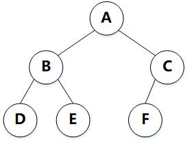

<!-- MarkdownTOC -->

- [二叉树](#二叉树)
    + [二叉树的分类](#二叉树的分类)
    + [二叉树的遍历](#二叉树的遍历)

<!-- /MarkdownTOC -->

# 二叉树

## 二叉树的分类

  
 

|
|:-:|-|
| 完美二叉树 | 一个深度为k(>=-1)且有2^(k+1) - 1个结点的二叉树称为完美二叉树 |
| 完满二叉树 | 所有非叶子节点的度都为2 |
| 完全二叉树 | 完美二叉树从最后一层，从右到左一次删掉部分节点 |

## 二叉树的遍历

  
 

前序遍历：A B D E C F

中序遍历：D B E A F C

后序遍历：D E B F C A

中序遍历用来确定根节点的左右子树，前序遍历中先遍历到的是对应该子树的根节点，后序遍历中最后遍历到的是对应该子树的根节点

**前序和中序--> 后序**：前序遍历用来确定树和子树的根节点，中序遍历用来确定根节点的左右子树

(1)首先根据前序遍历确定根节点为 A，那么根据中序遍历A的左子树的节点为 D B E，右子树的节点为 C F

(2)根据前序遍历顺序 B D E 可以知道，A 的左子树的根节点为 B，在根据中序遍历可以知道 D 是 B 的左子树，E 是 B 的右子树

(3)根据前序遍历顺序 C F 可知， A 的右子树的根节点为 C，那么根据中序遍历可以知道 F 是 C 的左子树

**中序和后序 --> 前序**：后序遍历用来确定树和子树的根节点，中序遍历用来确定根节点的左右子树

(1)首先根据后序遍历可以知道，A 是根节点，那么根据中序遍历可以知道 D B E 是 A 的左子树，F C 是 A 的右子树

(2)根据后序遍历的顺序 D E B 可以知道，B 是 A 的左子树的根节点，那么根据中序遍历可知 B 的左子树为 D，右子树为 E

(3)根据 A 的右子树在后序遍历的顺序 F C 可以知道，C 是右子树的根节点，再根据中序遍历可以知道 F 是 C 的左子树
