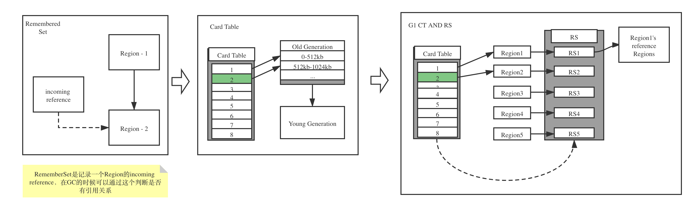

# JVM

## 问题排查命令

### 1.Dump命令

1.通过java -version查看虚拟机版本

2.通过jps查看java进程id, 或者ps -ef | grep java查看java进程的id
```
jps
ps -ef | grep java
```

3.通过jstack制作线程的dump信息, 可以用来查看线程的阻塞或者死锁等问题
```
jstack 进程id >> 文件名
```

Linux环境下制作线程dump
```
kill -quit 进程id
kill -3 进程id
```

4.通过下面的命令制作堆dump信息
```
jmap -histo:live 进程id
```
注意:谨慎使用jmap, jmap命令执行会直接触发一次fullGC

## JIT

just in time - 即时编译

Java代码通常的执行过程是: 生成class文件 --> 解释器翻译为机器码 --> 解释器执行
为了提高代码的执行效率, 可以使用编译器对热点代码就行编译, 将编译后的代码直接缓存其对应的机器码. 一般来说主要是对重复执行的方法和循环代码进行编译，热点代码的是通过JVM的两个计数器(方法调用计数器和回边计数器)实现

解释器和编译器执行的过程如下:

calss文件  --> 解释器解释 --> 执行机器码  --> 执行结果

class文件  --> 编译器编译 --> 缓存生成机器码 --> 执行机器码 --> 执行结果

JIT比解释快, 其实说的是“执行编译后的代码”比“解释器解释执行”要快, 并不是说“编译”这个动作比“解释”这个动作快. JIT编译再怎么快, 至少也比解释执行一次略慢一些, 而要得到最后的执行结果还得再经过一个“执行编译后的代码”的过程. 所以, 对“只执行一次”的代码而言, 解释执行其实总是比JIT编译执行要快.


CardTable(卡表), 用来解决跨代垃圾回收问题,  主要用于CMS和G1等垃圾回收器。在CMS中CardTable主要用来解决垃圾回收过程中老年代对于新生代的引用(老年代中的某个对象引用了新生代中的对象), 如果没有这个结构, 进行YGC的时候还需要扫描所有老年代中的GC Roots, GC的时间就会很长, 效率也会很低下。CardTable主要用来标识老年代中有哪些内存块中有指向新生代的引用, 在HotSpot垃圾收集器里CardTable是一个数组, 数组中的每一个元素代表着一块固定大小的内存区域, 这块内存区域叫CardPage, 每个CardPage管理着512bytes的内存空间, 如果在CardPage管理的这个内存空间中存在某个对象引用了新生代的对象, 那一部分的内存空间就要在YGC的时候也进行扫描

CMS中卡表的结构如下:

<div align="center">  </div>

卡表中的元素值什么时间更新?

1.在对象赋值的时刻去更新, 即有其他区域的对象引用了本区域的对象的时候

2.HotSpot虚拟机通过写屏障实现卡表中元素的更新

```
void oop_field_store(oop* field, oop new_value) {
  //引用字段赋值
  *field = new_value;
  //写后屏障, 在这里完成卡表状态的更新
  post_write_barrier(field, new_value)
}
```


## JVM博客

http://static.kancloud.cn/alex_wsc/javajvm/1844807
