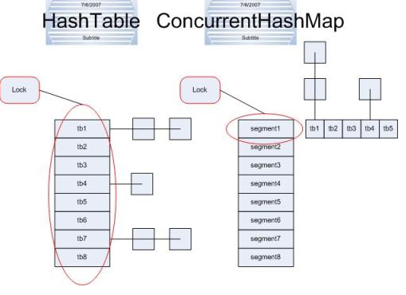
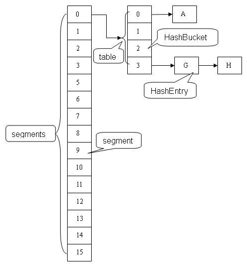
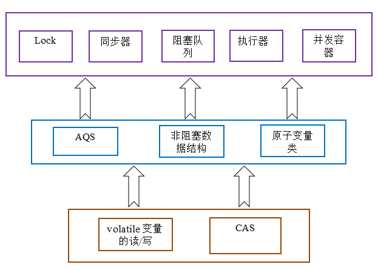
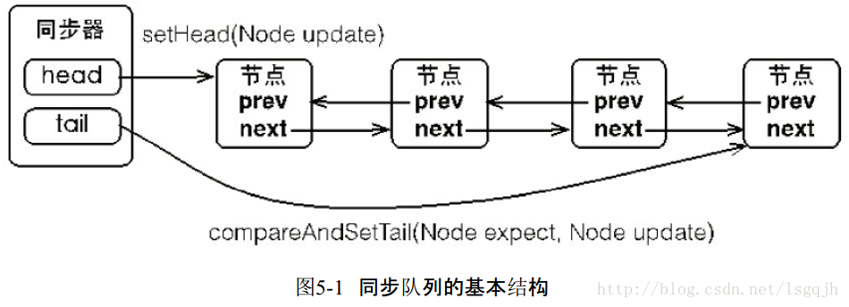

<!-- MarkdownTOC -->

- [Java](#java)
    + [接口和抽象类](#接口和抽象类)
    + [abstract private final](#abstract-private-final)
    + [多态](#多态)
    + [classpath](#classpath)
    + [String](#string)
    + [自动装箱和拆箱](#自动装箱和拆箱)
    + [Java 集合](#java-集合)
    + [枚举类](#枚举类)
    + [进程与线程](#进程与线程)
    + [死锁](#死锁)
    + [ThreadLocal](#threadlocal)
    + [Java内存模型 \(JMM\)](#java内存模型-jmm)
    + [多线程](#多线程)
        * [创建线程的三种方式](#创建线程的三种方式)
        * [线程的生命周期](#线程的生命周期)
        * [sleep、wait 和 yield](#sleepwait-和-yield)
        * [线程池](#线程池)
        * [BlockingQueue 阻塞队列](#blockingqueue-阻塞队列)
    + [AQS 队列同步器](#aqs-队列同步器)
    + [volatile 关键字](#volatile-关键字)
    + [设置线程池的大小](#设置线程池的大小)
    + [CAS \(compare and swap\)](#cas-compare-and-swap)
    + [线程安全](#线程安全)
        * [Synchronized](#synchronized)
        * [Lock](#lock)
        * [偏向锁、轻量级锁和重量级锁](#偏向锁轻量级锁和重量级锁)
    + [动态代理](#动态代理)
    + [NIO 与 IO](#nio-与-io)
    + [Java 反编译](#java-反编译)
    + [Java 反射](#java-反射)
    + [Java 注解](#java-注解)
    + [Java 中的元数据 Metadata](#java-中的元数据-Metadata)
- [设计模式](#设计模式)
    + [单例设计模式](#单例设计模式)
- [Java虚拟机](#java虚拟机)
    + [垃圾回收](#垃圾回收)
    + [CMS 和 G1](#cms-和-g1)
    + [类加载机制](#类加载机制)
    + [类的初始化](#类的初始化)
- [Java 8 新特性](#java-8-新特性)
- [Java 9 新特性](#java-9-新特性)

<!-- /MarkdownTOC -->

# Java

## 接口和抽象类

1.接口只能定义静态常量(public static final)，抽象类可以定义普通的成员变量

2.接口不能有构造方法，抽象类可以有构造方法，抽象类的构造方法是给子类调用完成抽象类的初始化

3.接口只能有抽象方法(public abstract)，抽象类还可以有普通的方法(不能是 private)

4.接口不能有初始化块，抽象类里面可以有初始化块

5.一个类可以实现多个接口，只能继承一个抽象类，接口可以继承多个接口

6.抽象类和接口中都不能有 static 方法，抽象类和接口是不能实例化的，即不能被分配内存；而 static 修饰的方法在类实例化之前就已经别分配了内存，这样一来矛盾就出现了；抽象类不能被分配内存，而 static 方法必须被分配内存。所以抽象类中不能有静态的抽象方法。

## abstract private final

abstract 和 private 不能共用，abstract 和 final 不能共用，abstract 和 static 不能共存

## 多态

多态是同一个行为具有多个不同表现形式或形态的能力。多态就是同一个接口，使用不同的实例而执行不同操作

多态存在的三个必要条件：

(1)继承

(2)父类引用指向子类实例

(3)重写

优点：

1.消除类型之间的耦合

## classpath 

1.src 不是 classpath，WEB-INF/classes，lib 才是 classpath，WEB-INF/ 是资源目录，客户端不能直接访问，在编译的时候 src 目录下的配置文件会被复制到 classpath 下。

2.WEB-INF/classes 目录存放 src 目录 java 文件编译之后的 class 文件，xml、properties 等资源配置文件，这是一个定位资源的入口。

3.引用 classpath 路径下的文件，只需在文件名前加 classpath:
```
<param-value>classpath:applicationContext-*.xml</param-value> 
<!-- 引用其子目录下的文件,如 -->
<param-value>classpath:context/conf/controller.xml</param-value>
```
4.lib 和 classes 同属 classpath，两者的访问优先级为: lib > classes。

5.classpath 和 classpath* 区别：
```
classpath：只会到你的 class 路径中查找找文件;
classpath*：不仅包含 class 路径，还包括 jar 文件中 (class 路径) 进行查找。
```

## String
```
/**
 * 编译期无法确定
 */
public void test(){
    String str1="abc";   
    String str2="def";   
    String str3=str1+str2;
    System.out.println("===========test============");
    System.out.println(str3=="abcdef"); //false
}
```
执行上述代码，结果为：false

分析：因为 str3 指向堆中的 "abcdef" 对象，而 "abcdef" 是字符串池中的对象，所以结果为 false。JVM对String str="abc"对象放在常量池中是在编译时做的，而String str3=str1+str2是在运行时刻才能知道的。new对象也是在运行时才做的。而这段代码总共创建了5个对象，字符串池中两个、堆中三个。+运算符会在堆中建立来两个String对象，这两个对象的值分别是"abc"和"def"，也就是说从字符串池中复制这两个值，然后在堆中创建两个对象，然后再建立对象str3，然后将"abcdef"的堆地址赋给str3。

执行过程：<br>
(1)栈中开辟一块中间存放引用str1，str1指向池中String常量"abc"。<br>
(2)栈中开辟一块中间存放引用str2，str2指向池中String常量"def"。<br> 
(3)栈中开辟一块中间存放引用str3。<br>
(4)str1 + str2通过StringBuilder的最后一步toString()方法还原一个新的String对象"abcdef"，因此堆中开辟一块空间存放此对象。<br>
(5)引用str3指向堆中(str1 + str2)所还原的新String对象。 <br>
(6)str3指向的对象在堆中，而常量"abcdef"在池中，输出为false。<br>

很好的一篇博客：https://www.cnblogs.com/xiaoxi/p/6036701.html

## 自动装箱和拆箱

1.Integer 和 int 的区别

(1)Integer 是 int 的包装类；int 是基本数据类型；

(2)Integer 变量必须实例化后才能使用；int 变量不需要； 

(3)Integer 实际是对象的引用，指向此 new 的 Integer 对象；int 是直接存储数据值； 

(4)Integer 的默认值是 null；int 的默认值是 0。

2.面试的问题

```
public class Main {
    public static void main(String[] args) {
         
        Integer a = 1;
        Integer b = 2;
        Integer c = 3;
        Integer d = 3;
        Integer e = 321;
        Integer f = 321;
        Long g = 3L;
        Long h = 2L;
         
        System.out.println(c==d); // true
        System.out.println(e==f); // false 只缓存-128~127
        System.out.println(c==(a+b)); // true (a+b)先触发自动拆箱 (调用 intValue()方法) 计算，然后自动装箱(调用 Integer.ValueOf(int i))
        System.out.println(c.equals(a+b)); // true
        System.out.println(g==(a+b)); // true 当 "=="运算符的两个操作数都是包装器类型的引用，则是比较指向的是否是同一个对象，而如果其中有一个操作数是表达式 (即包含算术运算) 则比较的是数值 (即会触发自动拆箱的过程)。另外，对于包装器类型，equals 方法并不会进行类型转换。明白了这 2 点之后，上面的输出结果便一目了然；
        System.out.println(g.equals(a+b)); // false 
        System.out.println(g.equals(a+h)); // true
    }
}
```

Integer 中的对象缓存是静态内部类 IntegerCache 实现的，创建的对象存储在 cache[] 数组中

3.自动拆箱和装箱的缺点

自动装箱有一个问题，那就是在一个循环中进行自动装箱操作的情况，如下面的例子就会创建多余的对象，影响程序的性能。
```
Integer sum = 0;
 for(int i=1000; i<5000; i++){
   sum+=i;
}
```

上面的代码 sum+=i 可以看成 sum = sum + i，但是 + 这个操作符不适用于 Integer 对象，首先 sum 进行自动拆箱操作，进行数值相加操作，最后发生自动装箱操作转换成 Integer 对象。其内部变化如下:

sum = sum.intValue() + i;

Integer sum = new Integer(result);

由于我们这里声明的 sum 为 Integer 类型，在上面的循环中会创建将近 4000 个无用的 Integer 对象，在这样庞大的循环中，会降低程序的性能并且加重了垃圾回收的工作量。因此在我们编程时，需要注意到这一点，正确地声明变量类型，避免因为自动装箱引起的性能问题。

因为自动装箱会隐式地创建对象，像前面提到的那样，如果在一个循环体中，会创建无用的中间对象，这样会增加 GC 压力，拉低程序的性能。所以在写循环时一定要注意代码，避免引入不必要的自动装箱操作。

参考的博客：http://www.importnew.com/15712.html

## Java 集合

Java 集合的两个根接口分别是，Collection(子接口是List, Set, Queue) 和 Map 接口

1.List

ArrayList 的默认大小是 10，每次扩容为原来的 1.5 倍，非线程安全，底层是通过 object[] 数组实现的

Vector 每次扩容为为原来的 2 倍，底层是通过 object[] 数组实现的

LinkedList 底层是通过双向链表实现的

2.Map

(1)HashMap

HashMap(继承AbstractMap) 只允许一个 key 值为 null，而且 key 为 null 的元素都存储在 table[0] 的位置

Hashtable(继承Dictionary) 中的 key 和 value 都不允许出现 null

HashMap 中默认的初始化容量为 16，每次扩容变为原来的两倍

Hashtable 中 hash 数组默认的大小是 11，每次扩容为原来的两倍加 1

Hashtable 中桶位置的计算 index = (hash & 0x7FFFFFFF) % tab.length;

HashMap 中桶位置的计算 h & (length-1)

HashMap 的应用场景：

HashMap 不适合在多线程的场景下直接使用，适合在单线程和对数据的存取顺序没有要求的情况下使用


(1)jdk7 中的 HashMap

默认的初始化容量为 16

插入元素的方法：
```
public V put(K key, V value) {
    if (table == EMPTY_TABLE) {
        inflateTable(threshold);
    }
    //键为空的元素放在 table[0]位置
    if (key == null)
        return putForNullKey(value);
    //获取 key 的 hashCode() 值
    int hash = hash(key);
    //通过 hash & (table.length-1) 求下标的位置
    //也就是取 hash 值的低 table.length-1 位
    int i = indexFor(hash, table.length);
    for (Entry<K,V> e = table[i]; e != null; e = e.next) {
        Object k;
        //如果 key 已经存在，就更新 value
        if (e.hash == hash && ((k = e.key) == key || key.equals(k))) {
            V oldValue = e.value;
            e.value = value;
            e.recordAccess(this);
            return oldValue;
        }
    }

    modCount++;
    //如果 key 不存在就添加到链表
    addEntry(hash, key, value, i);
    return null;
}
```

addEntry(...) 方法的源码：
```
void addEntry(int hash, K key, V value, int bucketIndex) {
    if ((size >= threshold) && (null != table[bucketIndex])) {
        //扩容
        resize(2 * table.length);
        //判断 key 是否为 null
        hash = (null != key) ? hash(key) : 0;
        //找到要插入的桶
        bucketIndex = indexFor(hash, table.length);
    }
    createEntry(hash, key, value, bucketIndex);
}
```

createEntry(...) 方法的源码：
```
void createEntry(int hash, K key, V value, int bucketIndex) {
    //找到对应链表的头节点
    Entry<K,V> e = table[bucketIndex];
    //头插法插入
    table[bucketIndex] = new Entry<>(hash, key, value, e);
    size++;
}
```

Entry 的结构：
```
static class Entry<K,V> implements Map.Entry<K,V> {
    final K key;
    V value;
    Entry<K,V> next;
    int hash;
```

扩容的方法：
```
void resize(int newCapacity) {
    Entry[] oldTable = table;
    int oldCapacity = oldTable.length;
    if (oldCapacity == MAXIMUM_CAPACITY) {
        threshold = Integer.MAX_VALUE;
        return;
    }
    Entry[] newTable = new Entry[newCapacity];
    transfer(newTable, initHashSeedAsNeeded(newCapacity));
    //创建一个新的 table
    table = newTable;
    threshold = (int)Math.min(newCapacity * loadFactor, MAXIMUM_CAPACITY + 1);
    }
```

扩容后转移元素的方法：
```
void transfer(Entry[] newTable, boolean rehash) {
    int newCapacity = newTable.length;
    //遍历每一个桶 (索引数组)
    for (Entry<K,V> e : table) {
        //遍历链表
        while(null != e) {
            //拆下节点之前，需要先记录当前节点的 next
            Entry<K,V> next = e.next;
            if (rehash) {
                e.hash = null == e.key ? 0 : hash(e.key);
            }
            int i = indexFor(e.hash, newCapacity);
            e.next = newTable[i];
            //头插法
            newTable[i] = e;
            e = next;
        }
    }
}
```

get 元素的方法：
```
public V get(Object key) {
    if (key == null)
        return getForNullKey();
    Entry<K,V> entry = getEntry(key);
    return null == entry ? null : entry.getValue();
}
```

getEntry() 方法：
```
final Entry<K,V> getEntry(Object key) {
    if (size == 0) {
        return null;
    }
    //判断 key 是否是 null
    int hash = (key == null) ? 0 : hash(key);
    for (Entry<K,V> e = table[indexFor(hash, table.length)];
            e != null;
            e = e.next) {
        Object k;
        if (e.hash == hash &&
            ((k = e.key) == key || (key != null && key.equals(k))))
            return e;
    }
    return null;
}
```

计算 hash 值源码：
```
final int hash(Object k) {
    int h = hashSeed;
    if (0 != h && k instanceof String) {
        return sun.misc.Hashing.stringHash32((String) k);
    }
    h ^= k.hashCode();

    h ^= (h >>> 20) ^ (h >>> 12);
    return h ^ (h >>> 7) ^ (h >>> 4);
}
```

(2)jdk8 中的 HashMap

(1)常用的参数

//默认的初始容量为 16 <br>
static final int DEFAULT_INITIAL_CAPACITY = 1 << 4;

//最大的容量上限为 2^30 <br>
static final int MAXIMUM_CAPACITY = 1 << 30;

//默认的负载因子为 0.75 <br>
static final float DEFAULT_LOAD_FACTOR = 0.75f;

//变成树型结构的临界值为 8 <br>
static final int TREEIFY_THRESHOLD = 8;

//恢复链式结构的临界值为 6 <br>
static final int UNTREEIFY_THRESHOLD = 6;

//哈希表 <br>
transient Node<K,V>[] table;

//哈希表中键值对的个数 <br>
transient int size;

//哈希表被修改的次数 <br>
transient int modCount;

//它是通过 capacity*load factor 计算出来的，当 size 到达这个值时，就会进行扩容操作 <br>
int threshold;

//负载因子 <br>
final float loadFactor;

//当哈希表的大小超过这个阈值，才会把链式结构转化成树型结构，否则仅采取扩容来尝试减少冲突 <br>
static final int MIN_TREEIFY_CAPACITY = 64;

(2)当链表长度太长(默认超过 8)时，链表就转换为红黑树，利用红黑树快速增删改查的特点提高 HashMap 的性能


参考博客：http://www.importnew.com/28263.html

参考博客：https://blog.csdn.net/u013124587/article/details/52649867

2.HashMap 线程不安全的原因

(1)当多个线程在插入元素时，同时检测到总数量超过 threshold 的时候就会 resize ，各自生成新的数组并赋给该 Map 底层的数组 table，结果最终只有最后一个线程生成的新数组被赋给 table 变量，其他线程的均会丢失。而且当某些线程已经完成赋值而其他线程刚开始的时候，就会用已经被赋值的 table 作为原始数组，这样也会有问题。

(2)两个线程同时进行扩容操作，线程 1 先扩容完毕后返回新的 table，线程 2 开始扩容，这时线程 2 操作的 table 已经变为线程 1 扩容完毕后的 table，这时就会产生链表环，导致再查询的时候，出现死循环。

出现死循环的这个问题只可能会在 Java7 中出现，Java8 已经修复了，出现这个循环的原因是因为在 java7 里面元素的插入(包括扩容）都是头插法

(下面第一篇博客中的示例就是假设了我们的 hash 算法就是简单的用 key mod 一下表的大小（也就是数组的长度）。其中的哈希桶数组 table 的 size=2， 所以 key = 3、7、5，put 顺序依次为 5、7、3。在 mod 2 以后都冲突在 table[1] 这里了。这里假设负载因子 loadFactor=1，即当键值对的实际大小 size 大于 table 的实际大小时进行扩容。接下来的三个步骤是哈希桶数组 resize 成 4，然后所有的 Node 重新 rehash 的过程。)

参考博客：https://coolshell.cn/articles/9606.html/comment-page-1#comments

参考博客：https://blog.csdn.net/qq_35721740/article/details/64904680

2.ConcurrentHashMap

<div align="center">  </div> 

ConcurrentHashMap 类中包含两个静态内部类 HashEntry 和 Segment。

HashEntry 用来封装映射表的键值对；Segment 用来充当锁的角色，每个 Segment 对象守护整个散列映射表的若干个桶。每个桶是由若干个 HashEntry 对象链接起来的链表。一个 ConcurrentHashMap 实例中包含由若干个 Segment 对象组成的数组。每个 Segment 守护者一个 HashEntry 数组里的元素，当对 HashEntry 数组的数据进行修改时，必须首先获得它对应的Segment锁。

<div align="center">  </div> 


参考博客：https://blog.csdn.net/dingjianmin/article/details/79776646

3.LinkedHashMap 可以保证数据的插入顺序，是通过“HashMap + 循环双向队列”实现的，默认的大小是 16，每次扩容为原来的 2 倍

<div align="center">  </div> 

header 是单独存在的，用来标识第一个添加的节点

每一次添加元素都是按照 HashMap 中的插入元素的方式添加，只是添加完毕还需要保证新插入的节点位于循环双向链表的末尾

LinkedHashMap 中的 Entry 数据结构：
```
private static class Entry<K,V> extends HashMap.Entry<K,V> {
    //在 HashMap 中 Entry 的基础上，多了两个指向前驱结点和后继节点的指针
    Entry<K,V> before, after;
```

LinkedHashMap 的数据迭代方式有两种，一种是按照访问顺序迭代，最近访问的放在列表的尾部，另外一种是按照数据的插入方式迭代，通过 accessOrder 来标志来实现
```
//true表示按照访问顺序迭代，false时表示按照插入顺序 
private final boolean accessOrder;  
```
## 枚举类

适合实现单例设计模式
```
public enum SeasonEnum {
    SPRING, SUMMER, FALL, WINTER;
}
```

枚举类的特点：

1.enum 和 class、interface 的地位一样。

2.使用enum定义的枚举类默认继承了 java.lang.Enum，而不是继承 Object 类。枚举类可以实现一个或多个接口。

3.枚举类的所有实例都必须放在第一行展示，不需使用 new 关键字，不需显式调用构造器。自动添加 public static final 修饰。

4.使用 enum 定义、非抽象的枚举类默认使用 final 修饰，不可以被继承。

5.枚举类的构造器只能是私有的。

## 进程与线程

1.进程与线程的区别：

(1)线程是调度的基本单位，进程是拥有资源的基本单位。

(2)进程有独立的地址空间，线程之间没有单独的地址空间，但是线程有自己的堆栈和局部变量。

(3)一个程序至少有一个进程，一个进程至少有一个线程。

(4)线程的划分尺度小于进程，使得多线程程序的并发性高。

(5)进程在执行过程中拥有独立的内存单元，而多个线程共享内存，从而极大地提高了程序的运行效率。

(6)线程在执行过程中与进程还是有区别的。每个独立的线程有一个程序运行的入口、顺序执行序列和程序的出口。但是线程不能够独立执行，必须依存在应用程序中，由应用程序提供多个线程执行控制。

(7)从逻辑角度来看，多线程的意义在于一个应用程序中，有多个执行部分可以同时执行。但操作系统并没有将多个线程看做多个独立的应用，来实现进程的调度和管理以及资源分配。这就是进程和线程的重要区别。

2.进程间通信方式

(1)管道：无名管道、高级管道、有名管道

(2)消息队列

(3)信号量

(4)信号

(5)共享内存

(6)套接字

3.线程间的通信方式

(1)利用共享变量实现

a.synchronized + notify() + wait()

b.Lock + Condition

(2)利用 CyclicBarrier，Semaphore 和 CountDownLatch

(3)利用 PipedInputStream

(4)利用 BlockingQueue

## 死锁

1.产生死锁的四个必要条件：

(1)互斥条件：一个资源每次只能被一个进程使用。

(2)请求与保持条件：一个进程因请求资源而阻塞时，对已获得的资源保持不放。

(3)不剥夺条件：进程已获得的资源，在未使用完之前，不能强行剥夺。

(4)循环等待条件：若干进程之间形成一种头尾相接的循环等待资源关系。

2.Java 中如何避免死锁

(1)避免一个线程同时获取多个锁，如果需要获取多个锁，保证获取锁的顺序都是一样的

(2)避免一个线程在锁内同时占用多个资源，尽量保证每个锁只占用一个资源

(3)尝试使用定时锁，使用 lock.tryLock 来代替使用内置锁。

## ThreadLocal

ThreadLocal 保存的共享变量，会为每一个调用的线程创建一个副本

(1)实际的通过 ThreadLocal 创建的副本是存储在每个线程自己的 threadLocals 中的；

(2)为何 threadLocals 的类型 ThreadLocalMap 的键值为 ThreadLocal 对象，因为每个线程中可有多个 threadLocal 变量；

(3)在进行 get 之前，必须先 set，否则会报空指针异常；如果想在get之前不需要调用set就能正常访问的话，必须重写initialValue()方法，而默认情况下，initialValue 方法返回的是 null。

使用实例：
```
private static final ThreadLocal threadSession = new ThreadLocal();  
public static Session getSession() throws InfrastructureException {  
    Session s = (Session) threadSession.get();  
    try {  
        if (s == null) {  
            s = getSessionFactory().openSession();  
            threadSession.set(s);  
        }  
    } catch (HibernateException ex) {  
        throw new InfrastructureException(ex);  
    }  
    return s;  
}  
```

## Java内存模型 (JMM)

Java 内存模型 (即 Java Memory Model) 是一个抽象的概念，是一种规则，它控制了各个变量 (包括实例字段、静态字段和数组中的元素) 在共享数据区 (主内存) 和私有数据区 (工作内存) 中的访问方式。JVM 中程序运行程序的实体就是线程，每个线程在创建时 JVM 都分配工作内存，工作内存区的数据是从主内存中拷贝过来的。Java 内存模型规定所有的变量都存储在主内存，所有线程都可以访问主内存，但是不能直接操作主内存的变量。每个线程只能先从主内存中拷贝变量到自己的工作内存中，然后操作变量，最后再把变量写入主内存。
<div align="center">  </div> 

程序执行的三个特性：原子性、可见性和有序性

原子性：就是指一个操作是不可中断的，一旦开始执行就不会受到其他线程的影响，比如赋值操作。i++ 就不是原子性操作，它包括读取 i 的值，进行加 1 操作，写入新的值，三个步骤。
可见性：指的是一个线程修改了某个共享变量的值，其他线程能否马上知道这个修改的值。由于指令的重排序和主内存和工作内存的同步延迟，可能出现可见性问题。

有序性：指的是程序的代码是按照顺序依次执行的，但是由于指令重排序或者主内存和工作内存的同步延迟问题，在多线程的情况下回出现问题。

## 多线程
### 创建线程的三种方式

1.继承Thread类
```
public class FirstThread extends Thread{
    private int i;
    public void run() {
        for(; i < 100; i++) {
            System.out.println(getName() + " " + i);
        }
    }
    public static void main(String[] args) {
        for(int i = 0; i < 100; i++) {
            System.out.println(Thread.currentThread().getName() + " " + i);
            if(i == 20) {
                new FirstThread().start();
                new FirstThread().start();
            }
        }
    }
}
```

2.实现Runnable接口
```
public class SecondThread implements Runnable{
    private int i;
    @Override
    public void run() {
        for(; i < 100; i++) {
            System.out.println(Thread.currentThread().getName() + " " + i);
        }
    }
    public static void main(String[] args) {
        for(int i = 0; i < 100; i++) {
            System.out.println(Thread.currentThread().getName() + " " + i);
            if(i == 20) {
                SecondThread st = new SecondThread();
                new Thread(st, "Thread-1").start();
                new Thread(st, "Thread-2").start();
            }
        }
    }
     
}
```

3.实现Callable接口
```
import java.util.concurrent.Callable;
import java.util.concurrent.FutureTask;

//实现多线程的方法三：使用Callable和Future创建线程
//创建Callable接口的实现类
public class ThirdThread implements Callable<Integer>{
    //实现Callable接口中的run()方法
    @Override
    public Integer call() throws Exception {
        // TODO Auto-generated method stub
        int i = 0;
        for(; i < 100; i++) {
            System.out.println(Thread.currentThread().getName() + " " + i);
        }
        return i;
    }
    public static void main(String[] args) {
        //创建Callable接口的实现类的实例对象
        ThirdThread tt = new ThirdThread();
        //使用FutureTask对象来包装Callable对象
        FutureTask<Integer> ft = new FutureTask<Integer>(tt);
        for(int i = 0; i < 100; i++) {
            System.out.println(Thread.currentThread().getName() + " " + i);
            if(i == 20) {
//              Thread th = new Thread(ft, "测试线程");
//              th.run();
                //直接调用run()方法后，th.start()不再执行
//              th.start();
//              new Thread(ft, "测试线程").run();
                try {
                    Thread.sleep(2);
                } catch (InterruptedException e) {
                    // TODO Auto-generated catch block
                    e.printStackTrace();
                }
                new Thread(ft, "有返回值的线程").start();
            }
        }
        try {
            System.out.println("子线程的返回值：" + ft.get() );
        } catch(Exception e) {
            e.printStackTrace();
        }
    }

}
```

### 线程的生命周期

线程的生命周期：新建(New)、就绪(Runnable)、运行(Running)、阻塞(Blocker)、死亡(Dead)
<div align="center">  </div><br>

### sleep、wait 和 yield
|sleep()、wait() 和 yield() 比较|
|-|
| sleep()、yield() 是线程类 (Thread) 的方法，wait() 是 Object 类的方法 |
| sleep()、yield() 不释放对象锁，wait() 释放对象锁 |
| sleep() 暂停线线程，会把执行机会让给其他线程，不考虑线程的优先级，yield()暂停线程，只会把线程让给同级或者优先级更高的线程 |
| sleep() 会抛 InterruptionException 的异常，但是 yield() 方法不会抛出任何异常 |
| wait() 后进入等待锁定池，只有针对此对象发出 notify()方法后获得对象锁进入**可运行状态**|
| wait() 和 notify() 会对对象的"锁标志"进行操作，所以它们必须在 synchronized 函数或 synchronized 代码块中进行调用。如果在 non-synchronized 函数或 non-synchronized 代码块中进行调用，虽然能编译通过，但在**运行时**会发生 IllegalMonitorStateException 的异常。|

### 线程池

1.线程池的创建

创建线程池由ThreadPoolExecutor类来完成，该类的一个最核心的构造方法就是:
```
public class ThreadPoolExecutor extends AbstractExecutorService {
    
    public ThreadPoolExecutor(int corePoolSize, int maximumPoolSize, 
                              long keepAliveTime, TimeUnit unit, 
                              BlockingQueue<Runnable> workQueue, 
                              ThreadFactory threadFactory, 
                              RejectedExecutionHandler handler);
```
参数含义:

|参数|含义|
|:-:|-|
| corePoolSize | 核心池的大小，这个参数跟后面讲述的线程池的实现原理有非常大的关系。在创建了线程池后，默认情况下，线程池中并没有任何线程，而是等待有任务到来才创建线程去执行任务，除非调用了prestartAllCoreThreads()或者prestartCoreThread()方法，从这2个方法的名字就可以看出，是预创建线程的意思，即在没有任务到来之前就创建corePoolSize个线程或者一个线程。默认情况下，在创建了线程池后，线程池中的线程数为0，当有任务来之后，就会创建一个线程去执行任务，当线程池中的线程数目达到corePoolSize后，就会把到达的任务放到缓存队列当中 |
| maximumPoolSize | 线程池最大线程数，这个参数也是一个非常重要的参数，它表示在线程池中最多能创建多少个线程 |
| keepAliveTime | 表示线程没有任务执行时最多保持多久时间会终止，默认情况下，只有当线程池中的线程数大于corePoolSize时，keepAliveTime才会起作用，直到线程池中的线程数不大于corePoolSize，即当线程池中的线程数大于corePoolSize时，如果一个线程空闲的时间达到keepAliveTime，则会终止，直到线程池中的线程数不超过corePoolSize。但是如果调用了allowCoreThreadTimeOut(boolean)方法，在线程池中的线程数不大于corePoolSize时，keepAliveTime参数也会起作用，直到线程池中的线程数为0 |
| unit | 参数keepAliveTime的时间单位，有7种取值，在TimeUnit类中有7种静态属性：<br>TimeUnit.DAYS;//天<br>TimeUnit.HOURS;//小时<br>TimeUnit.MINUTES;//分钟<br>TimeUnit.SECONDS;//秒<br>TimeUnit.MILLISECONDS;//毫秒<br>TimeUnit.MICROSECONDS;//微妙<br>TimeUnit.NANOSECONDS;//纳秒 |
| workQueue  | 一个阻塞队列，用来存储等待执行的任务，这个参数的选择也很重要，会对线程池的运行过程产生重大影响，一般来说，这里的阻塞队列有几种选择：ArrayBlockingQueue，LinkedBlockingQueue，SynchronousQueue。ArrayBlockingQueue和PriorityBlockingQueue使用较少，一般使用LinkedBlockingQueue和Synchronous。线程池的排队策略与 BlockingQueue 有关 |
| threadFactory | 线程工厂，主要用来创建线程 |
| handler | 表示当拒绝处理任务时的策略，有以下四种取值：<br>ThreadPoolExecutor.AbortPolicy：丢弃任务并抛出 RejectedExecutionException 异常<br>ThreadPoolExecutor.DiscardPolicy：也是丢弃任务，但是不抛出异常 <br>ThreadPoolExecutor.DiscardOldestPolicy：丢弃队列最前面的任务，然后重新尝试执行任务（重复此过程）<br>ThreadPoolExecutor.CallerRunsPolicy：由调用线程处理该任务 |

2.线程池中的几个核心问题的实现

(1)如何实现线程的复用

线程的生命周期中需要经过新建(new)、就绪(Runnable)、运行(Running)、阻塞(Blocked)、死亡(Dead) 5种状态
<div align="center">  </div><br>
Thread通过new关键字来创建一个线程，线程创建后调用start()方法启动线程，Java虚拟机会为其创建方法调用栈和程序计数器，同时将hasBeenStarted为true，之后调用start方法就会有异常。此时线程处于就绪状态，并没有开始运行，线程何时开始运行，取决于Java虚拟机中线程调度器的调度。线程获取cpu后，run()方法会被执行，不要直接调用run()方法。之后线程的状态在就绪————运行————阻塞之间切换，直到 run() 方法执行结束或者其他方式停止线程，线程才会进入 dead 状态。

因此，要想实现线程的复用，就需要让线程一直存活(就绪、运行或阻塞)，不能进入 dead 状态。

ThreadPoolExecutor 类通过 Worker 类来实现线程的复用，看看 worker 类的简化后的代码更容易理解：
```
private final class Worker implements Runnable {
 
    final Thread thread;
    Runnable firstTask;
    
    Worker(Runnable firstTask) {
        this.firstTask = firstTask;
        this.thread = getThreadFactory().newThread(this);
    }
    
    public void run() {
        runWorker(this);
    }
    
    final void runWorker(Worker w) {
        Runnable task = w.firstTask;
        w.firstTask = null;
        while (task != null || (task = getTask()) != null){
        task.run();
    }
}
```
Worker 类实现了 Runnable 接口，拥有 Thread 成员变量，这个 thread 就是要开启的线程。在创建 Worker 对象时，会创建一个新的线程，同时 Worker 对象自己会作为参数传入。这样当调用 Thread 的 start()时，实际上就是调用 Worker 对象的 run() 方法，接着调用 runWorker() 方法。在 runWorker()方法中，有一个 while 循环，它会从不断通过 getTast() 获取 Runnable 对象去执行。getTask()方法的简化代码如下：
```
private Runnable getTask() {
    if(一些特殊情况) {
        return null;
    }

    Runnable r = workQueue.take();

    return r;
}
```
这个 workQueue 就是初始化 ThreadPoolExecutor 时存放任务的 BlockingQueue 队列，这个队列里的存放的都是将要执行的 Runnable 任务。因为 BlockingQueue 是个阻塞队列，BlockingQueue.take() 得到如果是空，则进入等待状态直到 BlockingQueue 有新的对象被加入时唤醒阻塞的线程。所以一般情况 Thread 的 run() 方法就不会结束，而是不断执行从 workQueue 里的 Runnable 任务，这就达到了线程复用的作用了。

(2)控制线程最大并发数

那 Runnable 对象是什么时候放入 workQueue？Worker 对象又是什么时候创建，Worker里的Thread的又是什么时候调用 start()方法来执行 Worker 的 run() 方法的呢？有上面的分析看出 Worker 里的 runWorker()执行任务时是一个接一个，串行进行的，那并发是怎么体现的呢？

很容易想到是在 execute(Runnable runnable) 时会做上面的一些任务。看下 execute 方法里是怎么做的。execute() 方法简化后的代码：
```
public void execute(Runnable command) {
    if (command == null)
        throw new NullPointerException();

     int c = ctl.get();
    // 当前线程数 < corePoolSize
    if (workerCountOf(c) < corePoolSize) {
        // 直接启动新的线程。
        if (addWorker(command, true))
            return;
        c = ctl.get();
    }

    // 活动线程数 >= corePoolSize
    // runState为RUNNING && 队列未满
    // workQueue.offer(command)表示添加到队列，如果添加成功返回true，否则返回false
    if (isRunning(c) && workQueue.offer(command)) {
        int recheck = ctl.get();
        // 再次检验是否为RUNNING状态
        // 非RUNNING状态 则从workQueue中移除任务并拒绝
        if (!isRunning(recheck) && remove(command))
            reject(command);// 采用线程池指定的策略拒绝任务
        // 两种情况：
        // 1.非RUNNING状态拒绝新的任务
        // 2.队列满了启动新的线程失败（workCount > maximumPoolSize）
    } else if (!addWorker(command, false))
        reject(command);
}
```

addWorker() 方法的简化代码：
```
private boolean addWorker(Runnable firstTask, boolean core) {

    int wc = workerCountOf(c);
    if (wc >= (core ? corePoolSize : maximumPoolSize)) {
        return false;
    }

    w = new Worker(firstTask);
    final Thread t = w.thread;
    t.start();
}
```
根据代码再来看上面提到的线程池工作过程中的添加任务的情况：

(1)如果正在运行的线程数量小于 corePoolSize，那么马上创建线程运行这个任务；<br>
(2)如果正在运行的线程数量大于或等于 corePoolSize，那么将这个任务放入队列；<br>
(3)如果这时候队列满了，而且正在运行的线程数量小于 maximumPoolSize，那么还是要创建非核心线程立刻运行这个任务；<br>
(4)如果队列满了，而且正在运行的线程数量大于或等于 maximumPoolSize，那么线程池会抛出异常 RejectExecutionException。

通过 addWorker 如果成功创建新的线程成功，则通过 start() 开启新线程，同时将 firstTask 作为这个 Worker 里的 run() 中执行的第一个任务。

虽然每个 Worker 的任务是串行处理，但如果创建了多个 Worker，因为共用一个 workQueue，所以就会并行处理了。

(3)线程管理

通过线程池可以很好的管理线程的复用，控制并发数，以及销毁等过程,线程的复用和控制并发上面已经讲了，而线程的管理过程已经穿插在其中了，也很好理解。

在 ThreadPoolExecutor 有个 ctl 的 AtomicInteger 变量。通过这一个变量保存了两个内容：

(1)所有线程的数量<br>
(2)每个线程所处的状态<br>
其中低 29 位存线程数，高 3 位存 runState，通过位运算来得到不同的值。
```
private final AtomicInteger ctl = new AtomicInteger(ctlOf(RUNNING, 0));

//得到线程的状态
private static int runStateOf(int c) {
    return c & ~CAPACITY;
}


//得到Worker的的数量
private static int workerCountOf(int c) {
    return c & CAPACITY;
}


// 判断线程是否在运行
private static boolean isRunning(int c) {
    return c < SHUTDOWN;
}
```
这里主要通过shutdown和shutdownNow()来分析线程池的关闭过程。首先线程池有五种状态来控制任务添加与执行。主要介绍以下三种：

(1)RUNNING 状态：线程池正常运行，可以接受新的任务并处理队列中的任务；<br>
(2)SHUTDOWN 状态：不再接受新的任务，但是会执行队列中的任务；<br>
(3)STOP 状态：不再接受新任务，不处理队列中的任务<br>
shutdown 这个方法会将 runState 置为 SHUTDOWN，会终止所有空闲的线程，而仍在工作的线程不受影响，所以队列中的任务人会被执行。shutdownNow方法将 runState 置为 STOP。和 shutdown 方法的区别，这个方法会终止所有的线程，所以队列中的任务也不会被执行了。

这篇博客写的很好：http://silencedut.com/2016/06/25/从使用到原理学习Java线程池/

3.线程池的分类

CachedThreadPool  

```
public static ExecutorService newCachedThreadPool() {
    return new ThreadPoolExecutor(0, Integer.MAX_VALUE,
                                  60L, TimeUnit.SECONDS,
                                  new SynchronousQueue<Runnable>());
}
```

1.通过 Exectors.newCachedThreadPool() 静态静态方法来创建<br>2.线程数量不定的线程池<br>3.只有非核心线程，最大线程数量为Integer.MAX_VALUE，可视为任意大<br>4.有超时机制，时长为 60s，即超过 60s 的空闲线程就会被回收<br>
5.当线程池中的线程都处于活动状态时，线程池会创建新的线程来处理新任务，否则就会利用空闲的线程来处理新任务。因此任何任务都会被立即执行<br>
6.该线程池比较适合执行大量耗时较少的任务

FixedThreadPool

```
public static ExecutorService newFixedThreadPool(int nThreads) {
        return new ThreadPoolExecutor(nThreads, nThreads,
                                      0L, TimeUnit.MILLISECONDS,
                                      new LinkedBlockingQueue<Runnable>());
}
```

1.通过 Exectors.newFixedThreadPool(int nThreads) 静态方法来创建<br>2.线程数量固定的线程池<br>
3.只有核心线程切并且不会被回收<br>4.当所有线程都处于活动状态时，新任务都会处于等待状态，直到有线程空闲出来

ScheduledThreadPool

```
public static ScheduledExecutorService newScheduledThreadPool(int corePoolSize) {
        return new ScheduledThreadPoolExecutor(corePoolSize);
        //上面的 return 实际执行的是下面的代码
        return new ThreadPoolExecutor(corePoolSize, Integer.MAX_VALUE, 
                                      0, NANOSECONDS,
                                      new DelayedWorkQueue());
}
```

1.通过Exector的newScheduledThreadPool(int corePoolSize)静态方法来创建<br>
2.核心线程数量是固定的，而非核心线程数不固定的，并且非核心线程有超时机制，只要处于闲置状态就会被立即回收<br>3.该线程池主要用于执行定时任务和具有固定周期的重复任务

SingleThreadExecutor

```
public static ExecutorService newSingleThreadExecutor() {
        return new FinalizableDelegatedExecutorService
            (new ThreadPoolExecutor(1, 1,
                                    0L, TimeUnit.MILLISECONDS,
                                    new LinkedBlockingQueue<Runnable>()));
}
```

1.通过Exector的newSingleThreadPool静态方法来创建<br>
2.只有一个核心线程，它确保所有的任务都在同一个线程中按顺序执行。因此在这些任务之间不需要处理线程同步的问题<br>
3.当前线程如果出现异常，会重启一个线程去执行任务

### BlockingQueue 阻塞队列

1.阻塞队列的分类

(1)SynchronousQueue 是一个无界阻塞队列，但是该队列要求在添加任务完毕后必须等待任务被取走才能再次执行添加操作。如果没有线程可以立即执行新提交的任务，就新创建一个线程，所以一般要求线程池 maximumPoolSize 的大小需要是 Integer.MAX_VALUE，来避免任务被丢弃。

优点：可以避免处理具有内部依赖性的请求集时加锁，如果任务 A1 和 A2 之间有内部关联，A1 必须先运行，那么先提交 A1，后提交 A2，当使用 SynchronousQueue 时，A1 肯定先被执行

(2)ArrayBlockingQueue 是一个有界阻塞队列，是通过 object[] 数组 + 1个ReentrantLock 实现的阻塞队列。有公平和非公平两种阻塞队列。控制并发访问的锁对象只有一个 lock，两个 Condition 唤醒条件，notEmpty 用来唤醒 take 方法， notFull 用来唤醒 put 方法

优点：队列大小有界，有助于防止资源耗尽

缺点：队列的大小难以调整和控制

(3)LinkedBlockingQeque 是一个无界的阻塞队列，但是也可以设置队列的大小，变成有界阻塞队列，有三种构造方式 (Integer.MAXVALUE，声明的大小，将集合元素添加到队列)。是通过单向队列 + 2个ReentrantLock 的方式实现的。takeLock 是执行获取操作的锁，putLock 是执行添加操作的锁。
根据线程池的工作原理，如果 LinkedBlockingQueue 是无界的，那么创建的线程数量永远不会超过 corePoolSize。

优点：可用于处理瞬态突发请求，当命令以超过队列所能处理的平均数连续到达时，此策略允许任务具有无限增长的可能性；
由于 LinkedBlockingQueue 执行添加和获取操作的是两个不同的锁，生产者和消费者可以并行的操作队列中的数据，所以它的并发能力较高

2.LinkedBlockingQueue和ArrayBlockingQueue的区别

(1)队列大小有所不同，ArrayBlockingQueue是有界的初始化必须指定大小，而LinkedBlockingQueue可以是有界的也可以是无界的(Integer.MAX_VALUE)，对于后者而言，当添加速度大于移除速度时，在无界的情况下，可能会造成内存溢出等问题。

(2)数据存储容器不同，ArrayBlockingQueue采用的是数组作为数据存储容器，而LinkedBlockingQueue采用的则是以Node节点作为连接对象的链表。

(3)由于ArrayBlockingQueue采用的是数组的存储容器，因此在插入或删除元素时不会产生或销毁任何额外的对象实例，而LinkedBlockingQueue则会生成一个额外的Node对象。这可能在长时间内需要高效并发地处理大批量数据的时，对于GC可能存在较大影响。

(4)两者的实现队列添加或移除的锁不一样，ArrayBlockingQueue实现的队列中的锁是没有分离的，即添加操作和移除操作采用的同一个ReenterLock锁，而LinkedBlockingQueue实现的队列中的锁是分离的，其添加采用的是putLock，移除采用的则是takeLock，这样能大大提高队列的吞吐量，也意味着在高并发的情况下生产者和消费者可以并行地操作队列中的数据，以此来提高整个队列的并发性能。


参考博客：https://blog.csdn.net/javazejian/article/details/77410889


## AQS 队列同步器

AQS (Abstract Queue Synchronizer) 队列同步器由一个 Valotaile 变量标记状态 State，以及一个 CLH (同步、FIFO) 队列构成

具体实现类：

1. CountdownLatch： 等待多个线程完成 <br>
2. CyclicBarrier：同步屏障 <br>
3. Semaphore：控制并发线程数 <br>

## volatile 关键字

这篇博客讲的非常好：http://www.importnew.com/24082.html

volatile 是怎么实现修改后可见的？

volatile 源码分析

参考的博客：http://www.importnew.com/27863.html

## 设置线程池的大小

最佳线程数目 = (线程等待时间/线程执行时间 + 1) * CPU 数目

线程的等待时间越大需要的线程越多，线程的执行时间越大需要的线程越少

一般说来，大家认为线程池的大小经验值应该这样设置：(其中N为CPU的个数)

如果是 CPU 密集型应用，则线程池大小设置为 N+1

如果是 IO 密集型应用，则线程池大小设置为 2N+1


## CAS (compare and swap)

1.什么是 CAS？

CAS，compare and swap，中文就是比较并交换

2.为什么要用 CAS?

在 JDK1.5 之前，主要是通过 synchronize 关键字来保证线程的同步，这将会导致有锁。

锁机制存在如下的问题：

(1)在多线程竞争下，加锁、释放锁会导致比较多的上下文切换和调度延时，会引起性能问题<br>
(2)一个线程持有锁会导致其它所有需要此锁的线程挂起。<br>
(3)如果一个优先级高的线程等待一个优先级低的线程释放锁会导致优先级倒置，引起性能风险。<br>
volatile 是不错的机制，但是 volatile 不能保证原子性。因此对于同步最终还是要回到锁机制上来。

独占锁是一种悲观锁，synchronized 就是一种独占锁，会导致其它所有需要锁的线程挂起，等待持有锁的线程释放锁。而另一个更加有效的锁就是乐观锁。所谓乐观锁就是，每次不加锁而是假设没有冲突而去完成某项操作，如果因为冲突失败就重试，直到成功为止。乐观锁用到的机制就是 CAS，Compare and Swap。其实 CAS 也算是有锁操作，只不过是由 CPU 来触发，比 synchronized 性能好的多。CAS 的关键点在于，系统在硬件层面保证了比较并交换操作的原子性，处理器使用基于对缓存加锁或总线加锁的方式来实现多处理器之间的原子操作。

CAS 是非阻塞算法的一种常见实现。

3.CAS 的机制

CAS 有 3 个操作数，内存值 V，旧的预期值 A，要修改的新值 B。当且仅当预期值 A 和内存值 V 相同时，将内存值 V 修改为 B，否则什么都不做。

CAS 实现了区别于 sychronized 同步锁的一种乐观锁，当多个线程尝试使用 CAS 同时更新同一个变量时，只有其中一个线程能更新变量的值，而其它线程都失败，失败的线程并不会被挂起，而是被告知这次竞争中失败，并可以再次尝试。

一个线程间共享的变量，首先在主存中会保留一份，然后每个线程的工作内存也会保留一份副本。这里说的预期值，就是线程保留的副本。当该线程从主存中获取该变量的值后，主存中该变量可能已经被其他线程刷新了，但是该线程工作内存中该变量却还是原来的值，这就是所谓的预期值了。当你要用 CAS 刷新该值的时候，如果发现线程工作内存和主存中不一致了，就会失败，如果一致，就可以更新成功。

Atomic 包提供了一系列原子类。这些类可以保证多线程环境下，当某个线程在执行 atomic 的方法时，不会被其他线程打断，而别的线程就像自旋锁一样，一直等到该方法执行完成，才由 JVM 从等待队列中选择一个线程执行。Atomic 类在软件层面上是非阻塞的，它的原子性其实是在硬件层面上借助相关的指令来保证的。AtomicInteger 是一个支持原子操作的  Integer 类，就是保证对 AtomicInteger 类型变量的增加和减少操作是原子性的，不会出现多个线程下的数据不一致问题。如果不使用 AtomicInteger，要实现一个按顺序获取的 ID，就必须在每次获取时进行加锁操作，以避免出现并发时获取到同样的 ID 的现象。

用 AtomicInteger (jdk1.7) 来研究在没有锁的情况下是如何做到数据正确性的。
```
//借助volatile原语，保证线程间的数据是可见的
private volatile int value;

public final int get() {
        return value;
}
//++i的CAS实现代码
public final int incrementAndGet() {
    for (;;) {
        int current = get();
        int next = current + 1;
        if (compareAndSet(current, next))
            return next;
    }
}
```
在这里采用了 CAS 操作，每次从内存中读取数据然后将此数据和 +1 后的结果进行 CAS 操作，如果成功就返回结果，否则重试直到成功为止。而 compareAndSet 利用 JNI 来完成 CPU 指令的操作。
```
public final boolean compareAndSet(int expect, int update) {   
    return unsafe.compareAndSwapInt(this, valueOffset, expect, update);
}
```
其中，unsafe.compareAndSwapInt() 是一个 native 方法，正是调用 CAS 原语完成该操作。首先假设有一个变量 i，i 的初始值为 0。每个线程都对 i 进行 +1 操作。CAS 是这样保证同步的：假设有两个线程，线程 1 读取内存中的值为 0，current = 0，next = 1，然后挂起，然后线程 2 对 i 进行操作，将i的值变成了 1。线程 2 执行完，回到线程 1，进入 if 里的 compareAndSet 方法，该方法进行的操作的逻辑是:<br>
(1)如果操作数的值在内存中没有被修改，返回true，然后compareAndSet方法返回next的值<br>
(2)如果操作数的值在内存中被修改了，则返回false，重新进入下一次循环，重新得到 current的值为 1，next的值为 2，然后再比较，由于这次没有被修改，所以直接返回 2。
那么，为什么自增操作要通过 CAS 来完成呢？仔细观察 incrementAndGet()方法，发现自增操作其实拆成了两步完成的：<br>
int current = get();<br>
int next = current + 1;<br>
由于 volatile 只能保证读取或写入的是最新值，那么可能出现以下情况：<br>
1)A 线程执行 get() 操作，获取 current 值 (假设为 1)<br>
2)B 线程执行 get() 操作，获取 current 值 (为1)<br>
3)B 线程执行 next = current + 1 操作，next = 2<br>
4)A 线程执行 next = current + 1 操作，next = 2<br>
这样 current(值为 1)执行了两次自增操作，结果本应该是 3，现在得到的确是 2，所以，自增操作必须采用 CAS 来完成。

4.CAS 的优缺点

CAS 由于是在硬件层面保证的原子性，不会锁住当前线程，它的效率是很高的。CAS 虽然很高效的实现了原子操作，但是它依然存在三个问题。

(1)ABA 问题。因为 CAS 需要在操作值的时候检查下值有没有发生变化，如果没有发生变化则更新，但是如果一个值原来是 A，变成了 B，又变成了 A，那么使用 CAS 进行检查时会发现它的值没有发生变化，但是实际上却变化了。ABA 问题的解决思路就是使用版本号。在变量前面追加上版本号，每次变量更新的时候把版本号加一，那么 A-B-A 就会变成 1A-2B-3A。

从 Java1.5 开始 JDK 的 atomic 包里提供了一个类 AtomicStampedReference 来解决 ABA 问题。这个类的 compareAndSet 方法作用是首先检查当前引用是否等于预期引用，并且当前标志是否等于预期标志，如果全部相等，则以原子方式将该引用和该标志的值设置为给定的更新值。
```
public class AtomicStampedReference<V> {

    private static class Pair<T> {
        final T reference;
        final int stamp;
        private Pair(T reference, int stamp) {
            this.reference = reference;
            this.stamp = stamp;
        }
        static <T> Pair<T> of(T reference, int stamp) {
            return new Pair<T>(reference, stamp);
        }
    }

    private volatile Pair<V> pair;
```

(2)循环时间长开销大。自旋 CAS 如果长时间不成功，会给 CPU 带来非常大的执行开销。如果 JVM 能支持处理器提供的 pause 指令那么效率会有一定的提升，pause 指令有两个作用，第一它可以延迟流水线执行指令 (de-pipeline),使 CPU 不会消耗过多的执行资源，延迟的时间取决于具体实现的版本，在一些处理器上延迟时间是零。第二它可以避免在退出循环的时候因内存顺序冲突 (memory order violation) 而引起 CPU 流水线被清空 (CPU pipeline flush)，从而提高 CPU 的执行效率。

(3)只能保证一个共享变量的原子操作。当对一个共享变量执行操作时，我们可以使用循环CAS 的方式来保证原子操作，但是对多个共享变量操作时，循环 CAS 就无法保证操作的原子性，这个时候就可以用锁，或者有一个取巧的办法，就是把多个共享变量合并成一个共享变量来操作。比如有两个共享变量 i＝2, j=a，合并一下 ij=2a，然后用 CAS 来操作 ij。从 Java1.5 开始 JDK 提供了 AtomicReference 类来保证引用对象之间的原子性，你可以把多个变量放在一个对象里来进行 CAS 操作。 
这里粘贴一个，模拟 CAS 实现的计数器：
```
public class CASCount implements Runnable {
private SimilatedCAS counter = new SimilatedCAS();
public void run() {
for (int i = 0; i < 10000; i++) {
System.out.println(this.increment());
}
}

public int increment() {
int oldValue = counter.getValue();
int newValue = oldValue + 1;
while (!counter.compareAndSwap(oldValue, newValue)) { //
如果 CAS 失败,就去拿新值继续执行 CAS
oldValue = counter.getValue();
newValue = oldValue + 1;
}
return newValue;
}
public static void main(String[] args) {
Runnable run = new CASCount();
new Thread(run).start();
new Thread(run).start();
new Thread(run).start();
new Thread(run).start();
new Thread(run).start();
}
}
class SimilatedCAS {
private int value;
public int getValue() {
return value;
}
// 这里只能用 synchronized 了,毕竟无法调用操作系统的 CAS
public synchronized boolean compareAndSwap(int expectedValue,
int newValue) {
if (value == expectedValue) {
value = newValue;
return true;
}
return false;
}
}
```
5.concurrent 包的实现

由于 java 的 CAS 同时具有 volatile 读和 volatile 写的内存语义，因此 Java 线程之间的通信现在有了下面四种方式：<br>
(1)A 线程写 volatile 变量，随后 B 线程读这个 volatile 变量。<br>
(2)A 线程写 volatile 变量，随后 B 线程用 CAS 更新这个 volatile 变量。<br>
(3)A 线程用 CAS 更新一个 volatile 变量，随后 B 线程用 CAS 更新这个 volatile 变量。<br>
(4)A 线程用 CAS 更新一个 volatile 变量，随后 B 线程读这个 volatile 变量。<br>
Java 的 CAS 会使用现代处理器上提供的高效机器级别原子指令，这些原子指令以原子方式对内存执行读-改-写操作，这是在多处理器中实现同步的关键 (从本质上来说，能够支持原子性读-改-写指令的计算机器，是顺序计算图灵机的异步等价机器，因此任何现代的多处理器都会去支持某种能对内存执行原子性读-改-写操作的原子指令) 。同时，volatile 变量的读/写和 CAS 可以实现线程之间的通信。把这些特性整合在一起，就形成了整个 concurrent 包得以实现的基石。如果我们仔细分析 concurrent 包的源代码实现，会发现一个通用化的实现模式：<br>
首先，声明共享变量为 volatile；<br>
然后，使用 CAS 的原子条件更新来实现线程之间的同步；<br>
同时，配合以 volatile 的读/写和 CAS 所具有的 volatile 读和写的内存语义来实现线程之间的通信。

AQS，非阻塞数据结构和原子变量类 (java.util.concurrent.atomic包中的类)，这些 concurrent 包中的基础类都是使用这种模式来实现的，而 concurrent 包中的高层类又是依赖于这些基础类来实现的。从整体来看，concurrent 包的实现示意图如下：
<div align="center">  </div><br>

## 线程安全

### Synchronized

Synchronized 由 JVM 实现属于悲观锁

参考博客：https://blog.csdn.net/javazejian/article/details/77410889?locationNum=1&fps=1

### Lock

Lock 是一个接口，我们关注它的实现类 ReentrantLock 是如何实现公平锁和非公平锁

1.ReentrantLock 默认是非公平锁，也可以实现公平锁

2.ReentrantLock 是基于 AbstractQueuedSynchronizer 实现的，AbstractQueuedSynchronizer 可以实现独占锁也可以实现共享锁，ReentrantLock 只是使用了其中的独占锁模式

通过分析 ReentrantLock 中的公平锁和非公平锁的实现，其中 tryAcquire 是公平锁和非公平锁实现的区别 (源码见下文)，下面的两种类型的锁的 tryAcquire 的实现，从中我们可以看出在公平锁中，每一次的 tryAcquire 都会检查 CLH 队列中是否仍有前驱的元素，如果仍然有那么继续等待，通过这种方式来保证**先来先服务**的原则；而非公平锁，首先是检查并设置锁的状态，这种方式会出现即使队列中有等待的线程，但是新的线程仍然会与排队线程中的对头线程竞争(**但是排队的线程是先来先服务的**)，所以新的线程可能会抢占已经在排队的线程的锁，这样就无法保证先来先服务，但是已经等待的线程们是仍然保证先来先服务的，所以总结一下公平锁和非公平锁的区别：

3.ReentrantLock 由 JDK 实现属于乐观锁

a.公平锁能保证：老的线程排队使用锁，新线程仍然排队使用锁。

b.非公平锁保证：老的线程排队使用锁；但是无法保证新线程抢占已经在排队的线程的锁。

<div align="center">  </div><br>

(1)公平锁

```
protected final boolean tryAcquire(int acquires) {
    final Thread current = Thread.currentThread();
    int c = getState();
    if (c == 0) {
        // !hasQueuedPredecessors()保证了不论是新的线程还是已经排队的线程都顺序使用锁
        if (!hasQueuedPredecessors() &&
            compareAndSetState(0, acquires)) {
            setExclusiveOwnerThread(current);
            return true;
        }
    }
    else if (current == getExclusiveOwnerThread()) {
        int nextc = c + acquires;
        if (nextc < 0)
             throw new Error("Maximum lock count exceeded");
        setState(nextc);
        return true;
    }
    return false;
}
```

核心操作：

(1)获取一次锁数量，

(2)如果锁数量为 0，如果当前线程是等待队列中的头节点，基于 CAS 尝试将 state (锁数量)从 0 设置为 1 一次，如果设置成功，设置当前线程为独占锁的线程；

(3)如果锁数量不为 0 或者当前线程不是等待队列中的头节点或者上边的尝试又失败了，查看当前线程是不是已经是独占锁的线程了，如果是，则将当前的锁数量+1；如果不是，则将该线程封装在一个 Node 内，并加入到等待队列中去。等待被其前一个线程节点唤醒。

(2)非公平锁
```
final boolean nonfairTryAcquire(int acquires) {
    final Thread current = Thread.currentThread();
    int c = getState();
    if (c == 0) {
        // 新的线程可能抢占已经排队的线程的锁的使用权
        if (compareAndSetState(0, acquires)) {
            setExclusiveOwnerThread(current);
            return true;
        }
    }
    else if (current == getExclusiveOwnerThread()) {
        int nextc = c + acquires;
        if (nextc < 0) // overflow
             throw new Error("Maximum lock count exceeded");
        setState(nextc);
        return true;
    }
    return false;
}
```

核心的操作：

基于 CAS 尝试将 state（锁数量）从 0 设置为 1

(1)如果设置成功，设置当前线程为独占锁的线程；

(2)如果设置失败，还会再获取一次锁数量，

(3)如果锁数量为 0，再基于 CAS 尝试将 state（锁数量）从 0 设置为 1 一次，如果设置成功，设置当前线程为独占锁的线程；

(4)如果锁数量不为 0 或者上边的尝试又失败了，查看当前线程是不是已经是独占锁的线程了，如果是，则将当前的锁数量 +1；如果不是，则将该线程封装在一个 Node 内，并加入到等待队列中去。等待被其前一个线程节点唤醒。

参考博客：https://www.cnblogs.com/qifengshi/p/6831055.html

### 偏向锁、轻量级锁和重量级锁

很好的博客：https://blog.csdn.net/choukekai/article/details/63688332

## 动态代理

与静态代理相比，动态代理的好处就是不需要为每个类都生成代理类，可以在运行过程中动态生成代码

1.静态代理

(1)定义抽象主题接口
```
package com.atguigu.java;

/**
 * 接口
 * 抽象主题
 */
public interface IMath {
    //加
    int add(int n1, int n2);

}
```

(2)主题类，算术类，实现抽象接口
```
package com.atguigu.java;

/**
 * 被代理的目标对象
 *真实主题
 */
public class Math implements IMath {
    //加
    public int add(int n1,int n2){
        int result=n1+n2;
        System.out.println(n1+"+"+n2+"="+result);
        return result;
    }
    
}
```

(3)代理类
```
package com.atguigu.java;

import java.util.Random;

/**
 * 静态代理类
 */
public class MathProxy implements IMath {

    //被代理的对象
    IMath math=new Math();
    
    //加
    public int add(int n1, int n2) {
        //开始时间
        long start=System.currentTimeMillis();
        lazy();
        int result=math.add(n1, n2);
        Long span= System.currentTimeMillis()-start;
        System.out.println("共用时："+span);
        return result;
    }

    //模拟延时
    public void lazy()
    {
        try {
            int n=(int)new Random().nextInt(500);
            Thread.sleep(n);
        } catch (InterruptedException e) {
            e.printStackTrace();
        }
    }
}
```

(4)运行测试
```
package com.atguigu.java;

public class Test {
    
    IMath math=new MathProxy();
    @org.junit.Test
    public void test01()
    {
        int n1=100,n2=5;
        math.add(n1, n2);
    }
}
```

(5)**小结**

通过静态代理，是否完全解决了上述的4个问题：

已解决：

1)解决了“开闭原则 (OCP) ”的问题，因为并没有修改 Math 类，而扩展出了 MathProxy 类

2)解决了“依赖倒转 (DIP) ”的问题，通过引入接口

3)解决了“单一职责 (SRP) ”的问题，Math 类不再需要去计算耗时与延时操作，但从某些方面讲 MathProxy 还是存在该问题

未解决：

4)如果项目中有多个类，则需要编写多个代理类，工作量大，不好修改，不好维护，不能应对变化。

如果要解决上面的问题，可以使用动态代理。

2.JDK 动态代理

使用 JDK 内置的 Proxy 实现，只需要一个代理类，而不是针对每个类编写代理类。

在上一个示例中修改代理类MathProxy如下：
```
package com.atguigu.java1;

import java.lang.reflect.InvocationHandler;
import java.lang.reflect.Method;
import java.lang.reflect.Proxy;
import java.util.Random;

/**
 * 动态代理类
 */
public class DynamicProxy implements InvocationHandler {

    //被代理的对象
    Object targetObject;
    
    /**
     * 获得被代理后的对象
     * @param object 被代理的对象
     * @return 代理后的对象
     */
    public Object getProxyObject(Object object){
        this.targetObject=object;
        return Proxy.newProxyInstance(
                targetObject.getClass().getClassLoader(), //类加载器
                targetObject.getClass().getInterfaces(),  //获得被代理对象的所有接口
                this);  //InvocationHandler对象
        //loader:一个ClassLoader对象，定义了由哪个ClassLoader对象来生成代理对象进行加载
        //interfaces:一个Interface对象的数组，表示的是我将要给我需要代理的对象提供一组什么接口，如果我提供了一组接口给它，那么这个代理对象就宣称实现了该接口(多态)，这样我就能调用这组接口中的方法了
        //h:一个InvocationHandler对象，表示的是当我这个动态代理对象在调用方法的时候，会关联到哪一个InvocationHandler对象上，间接通过invoke来执行
    }
    
    
    /**
     * 当用户调用对象中的每个方法时都通过下面的方法执行，方法必须在接口
     * proxy 被代理后的对象
     * method 将要被执行的方法信息（反射）
     * args 执行方法时需要的参数
     */
    public Object invoke(Object proxy, Method method, Object[] args) throws Throwable {
        //被织入的内容，开始时间
        long start=System.currentTimeMillis();
        lazy();
        
        //使用反射在目标对象上调用方法并传入参数
        Object result=method.invoke(targetObject, args);
        
        //被织入的内容，结束时间
        Long span= System.currentTimeMillis()-start;
        System.out.println("共用时："+span);
        
        return result;
    }
    
    //模拟延时
    public void lazy()
    {
        try {
            int n=(int)new Random().nextInt(500);
            Thread.sleep(n);
        } catch (InterruptedException e) {
            e.printStackTrace();
        }
    }

}
```

测试运行
```
package com.atguigu.java1;

public class Test {
    
    //实例化一个MathProxy代理对象
    //通过getProxyObject方法获得被代理后的对象
    IMath math=(IMath)new DynamicProxy().getProxyObject(new Math());
    @org.junit.Test
    public void test01()
    {
        int n1=100,n2=5;
        math.add(n1, n2);
    }
    
    IMessage message=(IMessage) new DynamicProxy().getProxyObject(new Message());
    @org.junit.Test
    public void test02()
    {
        message.message();
    }
}
```
**小结**：

JDK内置的Proxy动态代理可以在运行时动态生成字节码，而没必要针对每个类编写代理类。中间主要使用到了一个接口InvocationHandler与Proxy.newProxyInstance静态方法。

使用内置的Proxy实现动态代理有一个问题：被代理的类必须实现接口，未实现接口则没办法完成动态代理。

3.CGLIB动态代理

CGLIB(Code Generation Library)是一个开源项目,是一个强大的，高性能，高质量的Code生成类库，它可以在运行期扩展Java类与实现Java接口，通俗说cglib可以在运行时动态生成字节码。

(1)引用cglib，通过maven

<div align="center">  </div><br>

(2)使用 cglib 完成动态代理，大概的原理是：cglib 继承被代理的类，重写方法，织入通知，动态生成字节码并运行，因为是继承所以 final 类是没有办法动态代理的。具体实现如下：
```
package com.atguigu.java2;

import java.lang.reflect.Method;
import java.util.Random;

import net.sf.cglib.proxy.Enhancer;
import net.sf.cglib.proxy.MethodInterceptor;
import net.sf.cglib.proxy.MethodProxy;

/*
 * 动态代理类
 * 实现了一个方法拦截器接口
 */
public class DynamicProxy implements MethodInterceptor {

    // 被代理对象
    Object targetObject;

    //动态生成一个新的类，使用父类的无参构造方法创建一个指定了特定回调的代理实例
    public Object getProxyObject(Object object) {
        this.targetObject = object;
        //增强器，动态代码生成器
        Enhancer enhancer=new Enhancer();
        //回调方法
        enhancer.setCallback(this);
        //设置生成类的父类类型
        enhancer.setSuperclass(targetObject.getClass());
        //动态生成字节码并返回代理对象
        return enhancer.create();
    }

    // 拦截方法
    public Object intercept(Object object, Method method, Object[] args, MethodProxy methodProxy) throws Throwable {
        // 被织入的横切内容，开始时间 before
        long start = System.currentTimeMillis();
        lazy();

        // 调用方法
        Object result = methodProxy.invoke(targetObject, args);

        // 被织入的横切内容，结束时间
        Long span = System.currentTimeMillis() - start;
        System.out.println("共用时：" + span);
        
        return result;
    }

    // 模拟延时
    public void lazy() {
        try {
            int n = (int) new Random().nextInt(500);
            Thread.sleep(n);
        } catch (InterruptedException e) {
            e.printStackTrace();
        }
    }

}
```

(3)测试运行：
```
package com.atguigu.java2;

public class Test {
    //实例化一个DynamicProxy代理对象
    //通过getProxyObject方法获得被代理后的对象
    Math math=(Math)new DynamicProxy().getProxyObject(new Math());
    @org.junit.Test
    public void test01()
    {
        int n1=100,n2=5;
        math.add(n1, n2);
    }
    //另一个被代理的对象,不再需要重新编辑代理代码
    Message message=(Message) new DynamicProxy().getProxyObject(new Message());
    @org.junit.Test
    public void test02()
    {
        message.message();
    }
}
```
(4)**小结**

使用 cglib 可以实现动态代理，即使被代理的类没有实现接口，但被代理的类必须不是 final 类。

如果项目中有些类没有实现接口，则不应该为了实现动态代理而刻意去抽出一些没有实例意义的接口，通过 cglib 可以解决该问题。

## NIO 与 IO

1.区别

(1)IO 是面向流(stream)的，NIO是面向缓冲区(channel和buffer)的；

(2)IO 只能一次从流中读取或者写入 1 个字节或者几个字节，没有缓冲，NIO 是先读入或者写入缓冲区，然后再处理，相对来说更灵活一些；

(3)IO 是阻塞的，当调用 read() 和 write() 方法时，直到读取到数据或者数据完全写入，否则就会一直处于阻塞状态，NIO 是非阻塞的，从某个通道发送请求读取数据，如果没有数据，线程就会去执行其他任务，不需要等待，通常线程会某个通道的 IO 空闲时间去执行其他通道的 IO 操作；

(4)Java NIO 的选择器允许一个单独的线程来监视多个输入通道，你可以注册多个通道使用一个选择器，然后使用一个单独的线程来“选择”通道：这些通道里已经有可以处理的输入，或者选择已准备写入的通道。这种选择机制，使得一个单独的线程很容易来管理多个通道。

## Java 反编译

假设现在有一个 test.java 文件

使用 javap -c test 就可以得到字节码文件，也就是每个方法所执行的JVM指令，可以分析源码级别的问题

## Java 反射

一般来说，我们要将编写的代码编译成 xxx.class 字节码文件，类的信息就在编译期间确定了下来，然后再运行。Java 的反射机制允许我们在程序的运行期间动态的获取类的详细信息和创建对象。反射的核心是 JVM 在运行时才动态加载类或调用方法/访问属性，它不需要事先（写代码的时候或编译期）知道运行对象是谁。

反射之中包含了一个“反”的概念，所以要想解释反射就必须先从“正”开始解释，一般而言，当用户使用一个类的时候，应该先知道这个类，而后通过这个类产生实例化对象，但是“反”指的是通过对象找到类。

Java 反射主要提供以下功能：

* 在运行时判断任意一个对象所属的类；
* 在运行时构造任意一个类的对象；
* 在运行时判断任意一个类所具有的成员变量和方法（通过反射甚至可以调用private方法）；
* 在运行时调用任意一个对象的方法

这些功能都是在运行期间完成，不是在编译时。

反射最重要的用途就是开发各种通用框架。很多框架（比如 Spring）都是配置化的（比如通过 XML 文件配置 Bean），为了保证框架的通用性，它们可能需要根据配置文件加载不同的对象或类，调用不同的方法，这个时候就必须用到反射，运行时动态加载需要加载的对象。

## Java 注解

Java中的创建注解的方式和创建类的方式一样，只不过创建类是 class XXX，而创建注解是 @interface XXX

注解的详细内容见博客：https://blog.csdn.net/javazejian/article/details/71860633

## Java 中的元数据 Metadata

元数据就是用来描述数据的数据。在程序中，就是添加到程序元素如类、方法、接口上的额外信息，Java 中的注解 Annotation(JDK1.5 之后加入的特性)就是属于元数据。元数据可以用来创建文档，跟踪代码的依赖性，执行编译时格式检查，**代替已有的配置文件**。

注意：Annotation 能被用来为程序元素（类、方法、成员变量等）设置元素据。Annotaion 不影响程序代码的执行，无论增加、删除 Annotation，代码都始终如一地执行。如果希望让程序中的 Annotation 起一定的作用，只有通过解析工具或编译工具对 Annotation 中的信息进行解析和处理。

详细的内容参照：https://www.jianshu.com/p/596d389282a0

# 设计模式

参考博客：https://blog.csdn.net/a724888/article/details/72637636

## 单例设计模式

1.懒汉式——双重校验锁
```
public class Singleton {
    //将对象实例用volatile修饰
    private volatile static Singleton singleton = null;
    private Singleton() {

    }
    public static Singleton getInstance() {
        //第一次校验
        if(singleton == null) {
            //加锁
            synchronized(Singleton.class) {
                //第二次校验
                if(singleton == null) {
                    singleton = new Singleton();
                }
            }
        }
        return singleton;
    }
}
```

2.饿汉式——静态内部类
```
public class Singleton {
    private Singleton() {
    
    }
    //当未调用getInstance()方法时，静态内部类不会被加载，单例对象就不会创建
    private static class SingletonHolder {
        private static Singleton instance = new Singleton();
    }
    public static Singleton getInstance(){
        return SingletonHolder.instance;
    }
    //添加下面这部分代码可以防止序列化的时候破坏单例模式，原因后面提到了
    private Object readResolve() {
        return singleton;
    }
}
```
这种方式存在的问题就是，如果Singleton实现了Serializable接口，那么就会被序列化成多个实例，也不能避免通过反射，调用构造方法，创建多个实例。

(1)序列化攻击
```
public void test() {
    Singleton s1= null;
    Singleton s = Singleton.getInstance();
    //序列化
    FileOutputStream fos = new FileOutputStream("Singleton.obj");
    ObjectOutputStream oos = new ObjectOutputStream(fos);
    oos.writeObject(s);
    oos.flush();
    oos.close();
    //反序列化
    FileInputStream fis = new FileInputStream("Singleton.obj");
    ObjectInputStream ois = new ObjectInputStream(fis);
    s1 = (Singleton)ois.readObject();
    //输出结果为false
    System.out.println(s==s1);
}
```
上面输出结果为 false，说明反序列化之后返回的是一个新的对象，为什么会这样呢？主要的原因就在 readObject() 方法，给出 readObject() 方法的源码:

readObject() 方法的调用栈：readObject--->readObject0--->readOrdinaryObject--->checkResolve
```
private Object readOrdinaryObject(boolean unshared)
        throws IOException
    {
        //此处省略部分代码
        Object obj;
        try {
            obj = desc.isInstantiable() ? desc.newInstance() : null;
        } catch (Exception ex) {
            throw (IOException) new InvalidClassException(
                desc.forClass().getName(),
                "unable to create instance").initCause(ex);
        }
 
        //此处省略部分代码
        if (obj != null &&
            handles.lookupException(passHandle) == null &&
            desc.hasReadResolveMethod())
        {
            Object rep = desc.invokeReadResolve(obj);
            if (unshared && rep.getClass().isArray()) {
                rep = cloneArray(rep);
            }
            if (rep != obj) {
                handles.setObject(passHandle, obj = rep);
            }
        }
 
        return obj;
    }
```

查看第一部分的代码：
```
Object obj;
        try {
            obj = desc.isInstantiable() ? desc.newInstance() : null;
        } catch (Exception ex) {
            throw (IOException) new InvalidClassException(
                desc.forClass().getName(),
                "unable to create instance").initCause(ex);
        }
```

isInstantiable()：如果一个 serializable/externalizable 的类可以在运行时被实例化，那么该方法就返回 true 

desc.newInstance：该方法通过反射的方式调用无参构造方法新建一个对象。

所以，也就可以解释，为什么序列化可以破坏单例了？是因为序列化会通过反射调用无参数的构造方法创建一个新的对象。

查看第二部分的代码：
```
if (obj != null &&
            handles.lookupException(passHandle) == null &&
            desc.hasReadResolveMethod())
        {
            Object rep = desc.invokeReadResolve(obj);
            if (unshared && rep.getClass().isArray()) {
                rep = cloneArray(rep);
            }
            if (rep != obj) {
                handles.setObject(passHandle, obj = rep);
            }
        }
```

hasReadResolveMethod()：如果实现了 serializable 或者 externalizable 接口的类中包含readResolve则返回 true 

invokeReadResolve：通过反射的方式调用要被反序列化的类的 readResolve 方法。

所以，原理也就清楚了，主要在Singleton中定义readResolve方法，并在该方法中指定要返回的对象的生成策略，就可以方式单例被破坏。

(2)反射攻击
```
public class Test
{
    public static void main(String[] args) {
        
        Class<Singleton> classType = Singleton.class;
        //通过反射获取构造函数
        Constructor<Singleton> c = (Constructor<Singleton>) classType.getDeclaredConstructor();
        //设置之后可以调用私有的构造函数
        c.setAccessible(true);
        //创建对象实例
        c.newInstance();
    }
}
```

3.枚举单例
```
public enum Singleton{
    INSTANCE;
}
```
最安全，最有效，最简单

很好的博客：http://blog.chenzuhuang.com/archive/13.html

# Java虚拟机

## 垃圾回收
Java的垃圾回收主要是回收堆中的对象实例，什么时候回收由系统决定。在垃圾回收之前，首先要通过可达性分析 (根节点是虚拟机栈中引用的对象、方法区中类静态属性引用的对象、方法区中常量引用的对象、本地方法栈中 JNI 引用的对象) 判断对象是否存活，然后将死亡的对象实例所占用的内存空间回收。堆所占用的内存可以划分为新生代和老年代，新生代内存空间进一步还可以细分为 EdenSpace、FromSurvivor、ToSurvivor，新创建的对象实例的内存大多数 (启用本地线程分配缓冲的按照线程优先在 TLAB 上分配，大对象 (很长的字符串和数组) 则直接进入老年代) 都在 EdenSpace 上分配。垃圾回收策略现在一般都是采用分代回收机制，新生代中，对象的存活率低，垃圾回收频率比较高，主要采用“复制”算法，老年代中对象的存活率高，垃圾回收频率较低，而且没有额外的空间对它进行分配担保，主要采用“标记-清理”和“标记-整理算法”。

## CMS 和 G1

CMS 垃圾收集器是以获取最短停顿时间为目标的垃圾回收器

优点；

并发清除，停顿时间短

缺点：

1)无法清理浮动垃圾 (就是并发清除过程中，又产生的垃圾)
      
2)采用标记-清除算法，会产生内存碎片，导致没有连续的空间分配给大对象，而触发 FullGC

1)初始标记：标记与 GC Roots 相关联的对象，需要停顿

2)并发标记：和用户线程一起执行

3)重新标记：标记在程序执行期间，对象状态发生变化的，需要停顿

4)并发清除：垃圾回收

G1 垃圾收集器，将堆区域拆分成对个大小相等的 Region (区域)，垃圾回收时根据每个 Region 的价值大小，优先回收价值较大的区域。

1)初始标记：标记与 GC Roots 相关联的对象，需要停顿

2)并发标记：和用户线程一起执行

3)最终标记：标记在程序执行期间，对象状态发生变化的，需要停顿

4)筛选回收：优先回收价值最大的区域

## 类加载机制

非常好的博客：https://blog.csdn.net/javazejian/article/details/73413292

## 类的初始化

1.子类引用父类的静态变量，父类不会发生初始化，也就是父类的静态初始化块不会执行

2.创建一个父类的数组，不会触发父类的初始化

3.测试输出某个类的静态常量 (static final) 不会触发这个类的初始化，因为在编译阶段的通过常量传播优化，已经将这个静态常量存储到了测试类的常量池中

4.初始化一个类，要求父类全部初始化完毕，但是父接口不需要，只有在引用父接口中的常量的时候才会初始化

# 日期处理类

Instant - 不可变的类，用来表示时间轴上一个瞬时的点

DateTime - 不可变的类，用来替换JDK的Calendar类, 来源于外界的二方包Joda

LocalDate - 不可变的类，表示一个本地的日期，而不包含时间部分（没有时区信息）

LocalTime - 不可变的类，表示一个本地的时间，而不包含日期部分（没有时区信息）

LocalDateTime - 不可变的类，表示一个本地的日期－时间（没有时区信息）

注意: 不可变的类，表明了正如Java的String类型一样，其对象是不可变的。即，不论对它进行怎样的改变操作，返回的对象都是新对象。

Instant比较适合用来表示一个事件发生的时间戳。不用去关心它使用的日历系统或者是所在的时区。

DateTime的主要目的是替换JDK中的Calendar类，用来处理那些时区信息比较重要的场景。

LocalDate比较适合表示出生日期这样的类型，因为不关心这一天中的时间部分。

LocalTime适合表示一个商店的每天开门/关门时间，因为不用关心日期部分。

```
public class DateTest {
    public static void main(String[] args) {
        Date expires = new Date(1577947349L*1000);
        SimpleDateFormat simpleDateFormat = new SimpleDateFormat("yyyy-MM-dd hh:mm:ss");
        System.out.println(simpleDateFormat.format(expires));
        // 本地时间
        LocalDate localDate = LocalDate.now();
        System.out.println(localDate);
        localDate.plusMonths(3);
        // Date date = new Date();
        Calendar calendar = Calendar.getInstance();
        // Calendar 和 date 转换
        Date calendarDate = calendar.getTime();
        calendar.add(Calendar.MONTH, 3);
        System.out.println(calendar.getTime());
        // Joda 更好用的时间类
        DateTime dateTime = new DateTime();
        // DateTime转date
        Date jodaDate = dateTime.toDate();
        // 操作时间
        // 增加90天
        dateTime.plusDays(90); 
        // 增加三个月
        dateTime.plusMonths(3);
        System.out.println(jodaDate);

    }

}
```


# Java 8 新特性

1.lambda 表达式 (省去了创建匿名内部类的麻烦)
```
//接口必须只有一个抽象方法
interface MyMath {
    int add(int a, int b);
}

MyMath math = (int a, int b) -> System.out.println(a+b);
MyMath math = (int a, int b) -> {
    System.out.println(a);
    System.out.println(b);
    System.out.println(a+b);
}
```

2.方法引用(::)

通过方法名调用方法，减少冗余代码的冗余

```
class MyTest {
    public void add() {
        System.out.println("use method add");
    }

    public static void main(String[] args) {
        MyTest t = new MyTest();
        t.forEach(MyTest::add);
    }
}
```

3.函数式接口

函数式接口就是有且只有一个抽象方法的接口，非抽象方法数量任意

JDK 1.8 新增加的函数接口：java.util.function ，更好的支持 lambda 表达式

4.Java 8 日期 API 

用来解决日期类不提供国际化，没有时区支持，非线程安全的问题

在 java.time 包下提供了很多新的 API。以下为两个比较重要的 API：

Local(本地) − 简化了日期时间的处理，没有时区的问题。

Zoned(时区) − 通过制定的时区处理日期时间

5.Optional 类

Optional 类是一个可以为 null 的容器，用来解决空指针异常

# Java 9 新特性

1.引入模块系统

模块系统就是代码和数据的封装体

声明一个模块
```
module com.runoob.mymodule {

}
```

2.Java中的模块化原理

深入理解Java模块化：https://juejin.im/post/5a7ecfef5188257a76632220
