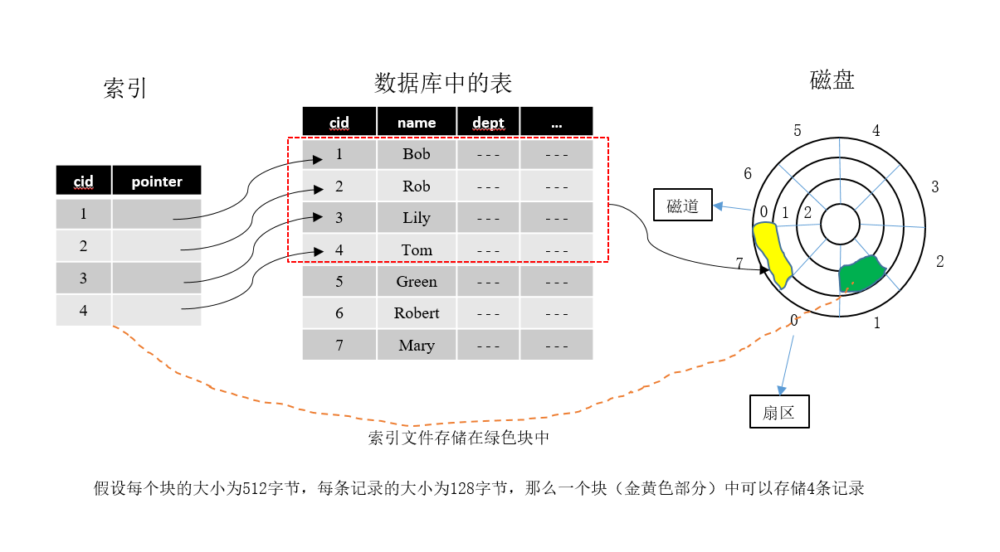
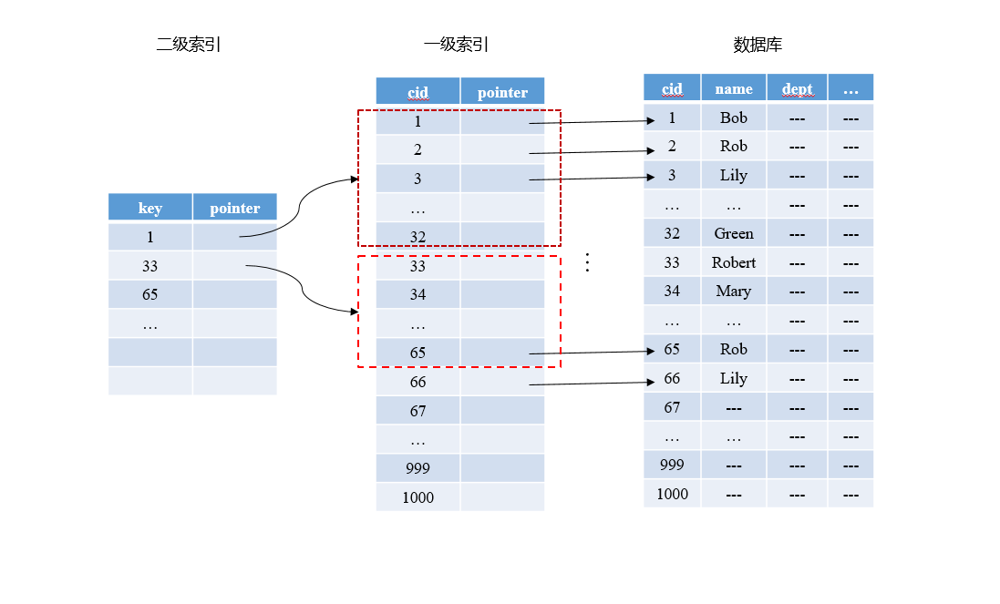

<!-- MarkdownTOC -->

- [MySQL](#mysql)
- [索引](#索引)
    + [B-Tree索引](#b-tree索引)
    + [MyISAM与InnoDB存储引擎](#myisam与innodb存储引擎)
        * [MyISAM索引](#myisam索引)
        * [InnoDB索引](#innodb索引)
- [红黑树](#红黑树)

<!-- /MarkdownTOC -->

# MySQL

# 索引

**索引**：是把一个关键码和它对应的数据记录的位置相关联的过程

**索引文件**：用于记录这种联系（关键码和它对应的数据记录的位置）的文件组织结构

数据按照某种顺序存储在磁盘中后，我们称之为主文件。建立索引就是在主文件之上创建索引文件，**索引文件的格式为(key, pointer)**, 其中key就是主文件中用来标识一条记录的key，pointer就是用来存储key所对应文件在磁盘中的存储位置。如下图所示：

  
 
数据表中保存的是员工信息，选取cid作为索引文件的key，pointer就指向该cid对应的磁盘中的一条记录。假如要查询一条cid==8的记录，我们还没有建立索引，就需要先将磁盘中的数据读入内存中，然后查询这些数据中是否有cid==8的记录，如果有就取出来，如果没有就继续查询，直到找到该记录为止。查询过程中，将数据库中的记录读入内存时，我们将一条记录的所有信息全部读入进去，这样我们一次性读入内存中的数据条数就会减少，这样一次IO访问所能查询的数据条数就会减少，查询的效率就很低。如果已经建立索引，我们只需要将索引文件读入内存中，索引文件中只保存了key和pointer，所需要的存储空间就比较小，一次可以读入多个索引记录，这样一次IO访问，所能查询的数据条数就会增加，查询效率也就提高了。

## B-Tree索引

在创建索引的过程中，如果主文件很大，那么一级索引相应的也会很大，查询的效率就会变得很低。这时候考虑建立二级甚至多级索引，假设一条索引记录为16字节，那么1000条索引记录，就需要40个块来存储。我们根据存储一级索引的块来建立二级索引，二级索引中一条记录指向一级索引中的一个块，二级索引一共需要2个块来存储。如下图所示：

  
 
如果要查找一条数据记录，那么我们最多只需要查询存储二级索引的2个块，一级索引中的某一个块和存储数据库数据的某一个块就完成此次数据查询。

如果我们的数据量变得更大，索引的层数也会增多，这样将上图顺时针旋转90度就变成了B-Tree索引

**B树就是一个满足如下要求的m叉树：**

1.如果一个节点不是叶子节点，也不是根节点，每个节点至少有[m/2]个孩子节点，至多有m个孩子节点

2.根节点至少有两个孩子

3.所有的叶子结点必须在同一层

4.B树的创建过程是从下到上创建

**B+树与B树的区别**是，B+树的非叶子节点中不保存磁盘数据的pointer信息，所有的信息都保存在叶子节点中。B树中的一个节点除了要保存孩子节点的pointer之外，还需要保存当前节点的key所对应的数据库中的某一条记录的pointer

## MyISAM与InnoDB存储引擎

|MyISAM|InnoDB|
|-|-|
| B+树索引 | B+树索引 |
| 非聚集索引 | 聚集索引 |
| 索引文件和数据库文件分开存储 | 索引文件就是数据库文件 |
| 主码索引与辅码索引都是具有相同的结构 | 主码索引与辅码索引差别较大 |
| 主码和辅码索引的叶子节点中存储的都是存储该条数据记录的地址 | 主码索引叶子节点中存储的就是该条数据记录，辅码索引叶子节点中存储的是该条数据记录对于的主码|
| 不支持事务 | 支持事务 |

1. 区别：

（1）事务处理：

MyISAM是非事务安全型的，而InnoDB是事务安全型的（支持事务处理等高级处理）；

（2）锁机制不同：

MyISAM是表级锁，而InnoDB是行级锁；

（3）select ,update ,insert ,delete 操作：

MyISAM：如果执行大量的SELECT，MyISAM是更好的选择
InnoDB：如果你的数据执行大量的INSERT或UPDATE，出于性能方面的考虑，应该使用InnoDB表
（4）查询表的行数不同：

MyISAM：select count(*) from table,MyISAM只要简单的读出保存好的行数，注意的是，当count(*)语句包含   where条件时，两种表的操作是一样的
InnoDB ： InnoDB 中不保存表的具体行数，也就是说，执行select count(*) from table时，InnoDB要扫描一遍整个表来计算有多少行
（5）外键支持：
mysiam表不支持外键，而InnoDB支持
2. 为什么MyISAM会比Innodb 的查询速度快。

INNODB在做SELECT的时候，要维护的东西比MYISAM引擎多很多；
1）数据块，INNODB要缓存，MYISAM只缓存索引块，  这中间还有换进换出的减少； 
2）innodb寻址要映射到块，再到行，MYISAM 记录的直接是文件的OFFSET，定位比INNODB要快
3）INNODB还需要维护MVCC一致；虽然你的场景没有，但他还是需要去检查和维护
MVCC ( Multi-Version Concurrency Control )多版本并发控制 
3. 应用场景
MyISAM适合：(1)做很多count 的计算；(2)插入不频繁，查询非常频繁；(3)没有事务。

InnoDB适合：(1)可靠性要求比较高，或者要求事务；(2)表更新和查询都相当的频繁，并且行锁定的机会比较大的情况。

### MyISAM索引

MyISAM主码索引的原理图：

  
 
&ensp;&ensp;&ensp;&ensp;图中数据表中的第一列是数据表的主键，B+树中的叶子节点中存储的是该主键对应的数据表中的一条记录的存储地址，根据这个存储地址就可以从磁盘中找到该记录，将其读入内存
  
MyISAM的辅码索引原理图：

  
 
&ensp;&ensp;&ensp;&ensp;图中是对数据表的第二列建立索引，其索引结构与主码索引完全相同，叶子节点存储的是该辅码对于的数据表中某一条记录的存储地址，辅码索引中的key是可以重复的

### InnoDB索引

InnoDB的主码索引原理图：

  
 
&ensp;&ensp;&ensp;&ensp;图中的数据表就是按照B+树的结构来存储的，所以数据表本身就是主码索引，索引的叶子节点中直接存储的是该主键对应的数据表中的一条记录，而不是这条记录的存储地址。
  
InnoDB的辅码索引的原理图：

  
 
&ensp;&ensp;&ensp;&ensp;图中索引的叶子节点中存储的既不是一条数据记录，也不是数据记录的地址，而是主码，也就是说InnoDB的辅码索引是建立在主码索引之上的，在数据查询过程中需要先根据辅码索引找到目标记录对应的主码，然后再根据主码查找到目标记录。所以，InnoDB的主码索引效率非常高，辅码索引的效率比较低。

参考的博客：https://blog.csdn.net/qq_26768741/article/details/53164202

# 红黑树

 红黑树就是一种二叉搜索树，但是还需要满足如下要求：
 
 1.节点非黑即红
 
 2.根节点是黑色
 
 3.叶子节点（为null或者nil）是黑色
 
 4.任意子树从根节点到叶子节点的任意一条路径，所经过的黑色节点个数是相同(为null和nil的叶子节点也计算在内)
 
 5.最长路径（root->最远的nil）的距离不能超过最短路径（root->最近的nil）的两倍
 
 
  
 
