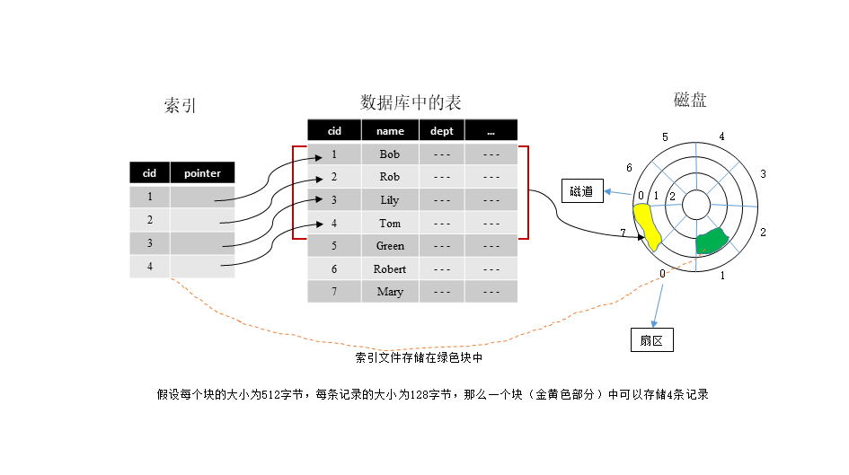

# MySQL

# 索引

索引：是把一个关键码和它对应的数据记录的位置相关联的过程

索引文件：用于记录这种联系(关键码和它对应的数据记录的位置)的文件组织结构

数据按照某种顺序存储在磁盘中后，我们称之为主文件。建立索引就是在主文件之上创建索引文件，索引文件的格式为(key, pointer)，其中key就是主文件中用来标识一条记录的key，pointer就是用来存储key所对应文件在磁盘中的存储位置。如下图所示：

  
 

数据表中保存的是员工信息，选取cid作为索引文件的key，pointer就指向该cid对应的磁盘中的一条记录。假如要查询一条cid==8的记录，我们还没有建立索引，就需要先将磁盘中的数据读入内存中，然后查询这些数据中是否有cid==8的记录，如果有就取出来，如果没有就继续查询，直到找到该记录为止。查询过程中，将数据库中的记录读入内存时，我们将一条记录的所有信息全部读入进去，这样我们一次性读入内存中的数据条数就会减少，这样一次IO访问所能查询的数据条数就会减少，查询的效率就很低。如果已经建立索引，我们只需要将索引文件读入内存中，索引文件中只保存了key和pointer，所需要的存储空间就比较小，一次可以读入多个索引记录，这样一次IO访问，所能查询的数据条数就会增加，查询效率也就提高了。
