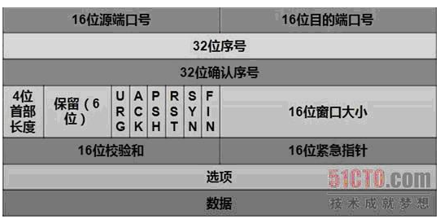
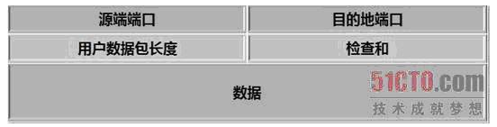

<!-- MarkdownTOC -->

- [计算机网络](#计算机网络)
    + [TCP三次握手和四次挥手](#tcp三次握手和四次挥手)
        * [TCP 和 UDP](#tcp-和-udp)
        * [TCP 中的拥塞控制](#tcp-中的拥塞控制)
        * [OSI 网络模型](#osi-网络模型)

<!-- /MarkdownTOC -->

# 计算机网络

## TCP三次握手和四次挥手

一、建立连接

TCP在传输之前会进行三次沟通，一般称为“三次握手”，传完数据断开的时候要进行四次沟通，一般称为“四次挥手”。

两个序号和三个标志位：

1.序号：seq 序号，占 32 位，用来标识从 TCP 源端向目的端发送的字节流，发起方发送数据时对此进行标记。

2.确认序号：ack 序号，占 32 位，只有 ACK 标志位为 1 时，确认序号字段才有效，ack=seq+1。

3.标志位：共 6 个，即 URG、ACK、PSH、RST、SYN、FIN 等，具体含义如下：
* URG：紧急指针（urgent pointer）有效。
* ACK：确认序号有效。
* PSH：接收方应该尽快将这个报文交给应用层。
* RST：重置连接。
* SYN：发起一个新连接。
* FIN：释放一个连接。

需要注意的是：

(1)不要将确认序号 ack 与标志位中的 ACK 搞混了。

(2)确认方 ack=发起方seq+1，两端配对。

  
 

 图1 用三次握手建立TCP连接 
  

第一次 A 随机选取一个序列号作为自己的初始序号发送给 B；

第二次消息 B 使用 ack 对 A 的数据包进行确认，因为已经收到了序列号为x的数据包，准备接收序列号为x+1的包，所以ack=x+1，同时B告诉A自己的初始序列号，就是seq=y；

第三次消息 A 告诉 B 收到了 B 的确认消息并准备建立连接，A 自己此条消息的序列号是 x+1，所以 seq=x+1，而 ack=y+1 是表示 A 正准备接收 B 序列号为 y+1 的数据包。

为什么要用三次握手？

  
 

二、释放连接

  
 

 图2 用四次挥手释放TCP连接 
  

由于 TCP 连接时全双工的，因此，每个方向都必须要单独进行关闭，这一原则是当一方完成数据发送任务后，发送一个 FIN 来终止这一方向的连接，收到一个 FIN 只是意味着这一方向上没有数据流动了，即不会再收到数据了，但是在这个 TCP 连接上仍然能够发送数据，直到这一方向也发送了 FIN。

首先进行关闭的一方将执行主动关闭，而另一方则执行被动关闭，上图描述的即是如此。

1. 第一次挥手：Client 发送一个 FIN，用来关闭 Client 到 Server 的数据传送，Client 进入 FIN_WAIT_1 状态。
2. 第二次挥手：Server 收到 FIN 后，发送一个 ACK 给 Client，确认序号为收到序号 +1 (与 SYN 相同，一个 FIN 占用一个序号 )，Server 进入 CLOSE_WAIT 状态。
3. 第三次挥手：Server 发送一个 FIN，用来关闭 Server 到 Client 的数据传送，Server 进入 LAST_ACK 状态。
4. 第四次挥手：Client 收到 FIN 后，Client 进入 TIME_WAIT 状态，接着发送一个 ACK 给 Server，确认序号为收到序号 +1，Server 进入 CLOSED 状态，完成四次挥手。

  
 

  
 

为什么TIME_WAIT状态需要经过2MSL(最大报文段生存时间)才能返回到CLOSE状态？

  
 

四、面试问题

1.为什么建立连接是三次握手？

(1)一方面，因为双方都要对对方发送的数据进行确认，那么最少都需要两次握手，如果是两次握手的话，当服务器向客户端发送一个 ACK 后，服务器会认为连接已经建立完成，服务器就会进入 ESTABLISHED 状态，如果一个 ACK 丢了，服务器认为连接建立好了，服务器就会为此维护相应的资源用来管理这个连接，而客户端认为连接没有成功建立，所以这个连接无意义，但是服务器会一直维持这个连接，就会浪费服务器的资源。 

对于三次握手而言，如果最后一个 ACK 丢了，服务器认为连接没有成功建立，虽然客户端认为连接已经成功建立，但是对服务器没有太大消耗，服务器收不到 ACK 就会重新发送建立连接请求。 

因为三次握手已经可以满足需求了，所以不需要更多次的握手。 

(2)另一方面，建立连接是双方的事情，你要向我建立连接，我也要向你建立连接，所以双方都需要向对方请求建立连接，然后双方互相确认，看起来像四次握手，因为 TCP 能够捎带应答，所以服务器向客户端请求建立连接的 SYN 就可以乘着对客户端的 ACK 一起发送，所以就将四次握手合并成了三次握手。

2.为什么关闭连接却是四次握手呢？

(1)同样断开连接也是双方的事情，你要向我断开连接，我也要向你断开连接，双方还要进行确认，所以是四次挥手，但是服务器的 ACK 和 FIN 却不能合并，所以无法是三次挥手。

(2)为什么断开连接时，服务器对客户端的 FIN 和 ACK 无法合并？ 

* 因为如果客户端先断开连接，只是表明客户端没有数据要发送给服务器了，但是服务器有可能还会向客户端发送数据，那么服务器向客户端发送 ACK 之后到服务器发送 FIN 之间 (即 CLOSE_WAIT状态到 LAST_ACK 之间)会有很长的时间间隔，那么这两个步骤就不能合并。 

* 另一方面，服务器发送 FIN 进入 LAST_ACK 状态是由用户调用 close 函数实现的，而服务器发送 ACK 是由内核实现的也说明这两步不能合成一步，但是三次握手中建立连接和确认都是由内核实现所以可以合成一步。

参考博客：https://blog.csdn.net/qzcsu/article/details/72861891

三、三次握手和四次握手的 11 个状态：

LISTEN：等待从任何远端 TCP 和端口的连接请求。

SYN_SENT：发送完一个连接请求后等待一个匹配的连接请求。

SYN_RECEIVED：发送连接请求并且接收到匹配的连接请求以后等待连接请求确认。

ESTABLISHED：表示一个打开的连接，接收到的数据可以被投递给用户。连接的数据传输阶段的正常状态。

FIN_WAIT_1：等待远端 TCP 的连接终止请求，或者等待之前发送的连接终止请求的确认。

FIN_WAIT_2：等待远端 TCP 的连接终止请求。

CLOSE_WAIT：等待本地用户的连接终止请求。

CLOSING：等待远端 TCP 的连接终止请求确认。

LAST_ACK：等待先前发送给远端 TCP 的连接终止请求的确认（包括它字节的连接终止请求的确认）

TIME_WAIT：等待足够的时间过去以确保远端 TCP 接收到它的连接终止请求的确认。

TIME_WAIT 两个存在的理由：

1.可靠的实现 TCP 全双工连接的终止；

2.允许老的重复分节在网络中消逝。

CLOSED：不在连接状态 (这是为方便描述假想的状态，实际不存在)

### TCP 和 UDP

1.TCP 是面向连接的，UDP 是无连接的，发送数据之前不需要建立连接

2.TCP 提供可靠的服务，通过 TCP 连接传送的数据，无差错，不丢失，不重复，且按序到达，UDP 是尽最大努力交付，不保证可靠交付

3.TCP 通过校验和，重传控制，序号标识，滑动窗口、确认应答实现可靠传输。如丢包时的重发控制，还可以对次序乱掉的分包进行顺序控制。

4.UDP 具有较好的实时性，工作效率也比 TCP 高

5.每一条 TCP 连接都是点到点的，UDP 支持一对一，一对多，多对一和多对多的交互通信

TCP 和 UDP 的头部信息

TCP 头部 20 字节

  
 

UDP 头部 8 字节

  
 

### TCP 中的拥塞控制

### OSI 网络模型

参考博客：https://www.cnblogs.com/qishui/p/5428938.html

