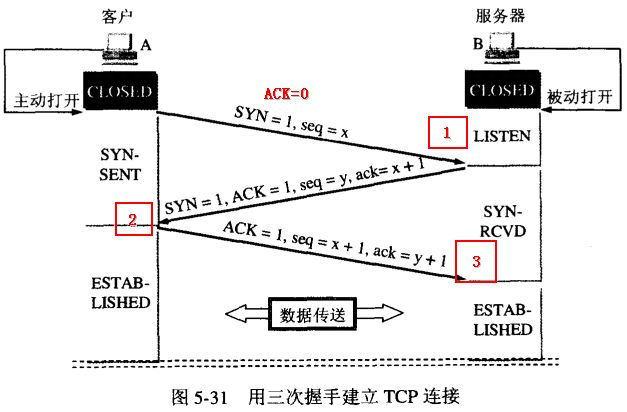
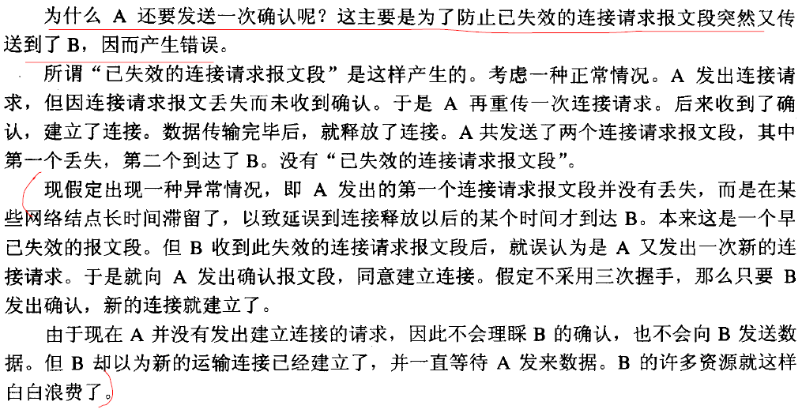

# 计算机网络
## TCP三次握手和四次挥手

一、建立连接

TCP在传输之前会进行三次沟通，一般称为“三次握手”，传完数据断开的时候要进行四次沟通，一般称为“四次挥手”。

两个序号和三个标志位：

1.序号：seq 序号，占 32 位，用来标识从 TCP 源端向目的端发送的字节流，发起方发送数据时对此进行标记。

2.确认序号：ack 序号，占 32 位，只有 ACK 标志位为 1 时，确认序号字段才有效，ack=seq+1。

3.标志位：共 6 个，即 URG、ACK、PSH、RST、SYN、FIN 等，具体含义如下：
* URG：紧急指针（urgent pointer）有效。
* ACK：确认序号有效。
* PSH：接收方应该尽快将这个报文交给应用层。
* RST：重置连接。
* SYN：发起一个新连接。
* FIN：释放一个连接。

需要注意的是：

(1)不要将确认序号 ack 与标志位中的 ACK 搞混了。

(2)确认方 ack=发起方req+1，两端配对。

  
 

 图1 用三次握手建立TCP连接 
  

在第一次消息发送中，A 随机选取一个序列号作为自己的初始序号发送给 B；

第二次消息 B 使用 ack 对 A 的数据包进行确认，因为已经收到了序列号为x的数据包，准备接收序列号为x+1的包，所以ack=x+1，同时B告诉A自己的初始序列号，就是seq=y；

第三条消息 A 告诉 B 收到了 B 的确认消息并准备建立连接，A 自己此条消息的序列号是 x+1，所以 seq=x+1，而 ack=y+1 是表示 A 正准备接收 B 序列号为 y+1 的数据包。

为什么要用三次握手？

  
 

二、释放连接

  
 

 图2 用四次挥手释放TCP连接 
  

由于 TCP 连接时全双工的，因此，每个方向都必须要单独进行关闭，这一原则是当一方完成数据发送任务后，发送一个 FIN 来终止这一方向的连接，收到一个 FIN 只是意味着这一方向上没有数据流动了，即不会再收到数据了，但是在这个 TCP 连接上仍然能够发送数据，直到这一方向也发送了 FIN。

首先进行关闭的一方将执行主动关闭，而另一方则执行被动关闭，上图描述的即是如此。

1. 第一次挥手：Client 发送一个 FIN，用来关闭 Client 到 Server 的数据传送，Client 进入 FIN_WAIT_1 状态。
2. 第二次挥手：Server 收到 FIN 后，发送一个 ACK 给 Client，确认序号为收到序号 +1 (与 SYN 相同，一个 FIN 占用一个序号 )，Server 进入 CLOSE_WAIT 状态。
3. 第三次挥手：Server 发送一个 FIN，用来关闭 Server 到 Client 的数据传送，Server 进入 LAST_ACK 状态。
4. 第四次挥手：Client 收到 FIN 后，Client 进入 TIME_WAIT 状态，接着发送一个 ACK 给 Server，确认序号为收到序号 +1，Server 进入 CLOSED 状态，完成四次挥手。

  
 

  
 

为什么TIME_WAIT状态需要经过2MSL(最大报文段生存时间)才能返回到CLOSE状态？

  
 

为什么建立连接是三次握手，而关闭连接却是四次挥手呢？

这是因为服务端在 LISTEN 状态下，收到建立连接请求的 SYN 报文后，把 ACK 和 SYN 放在一个报文里发送给客户端。而关闭连接时，收到对方的 FIN 报文时，仅仅表示对方不再发送数据了但是还能接收数据，己方也未必全部数据都发送给对方了，所以己方可以立即 close，也可以发送一些数据给对方后，再发送 FIN 报文给对方来表示同意现在关闭连接，因此，己方 ACK 和 FIN 一般都会分开发送。