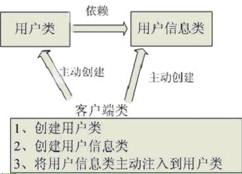
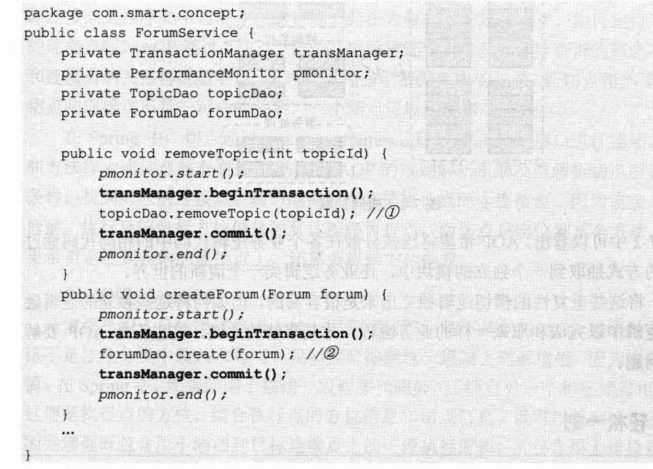
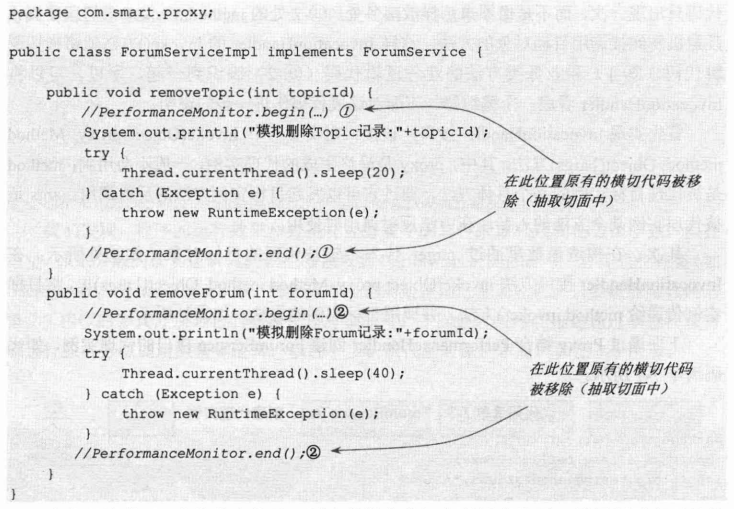
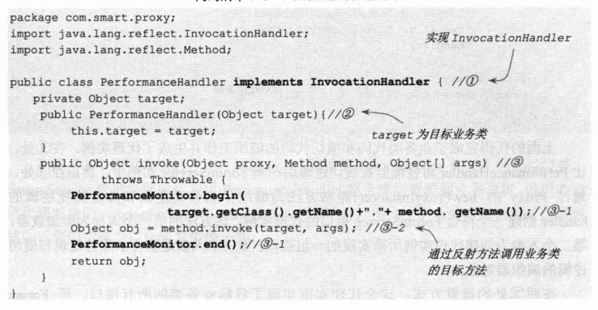
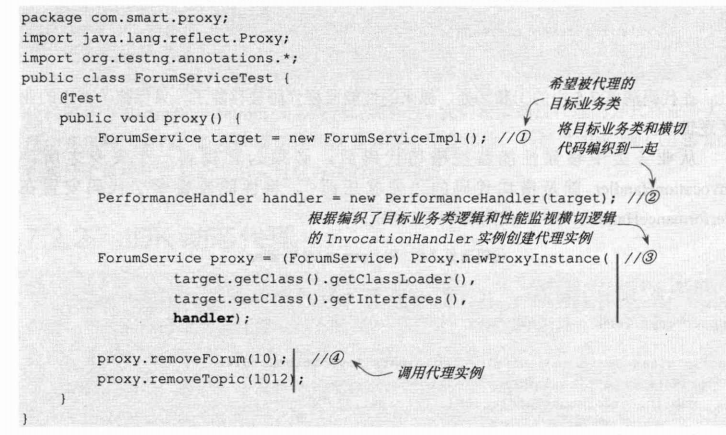
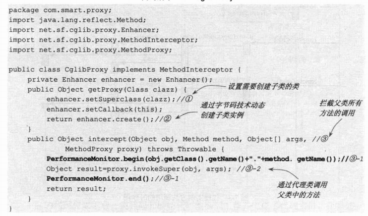
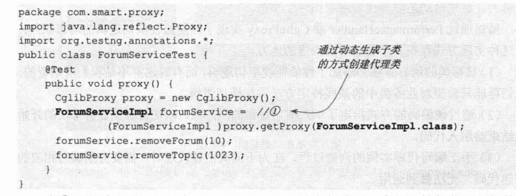
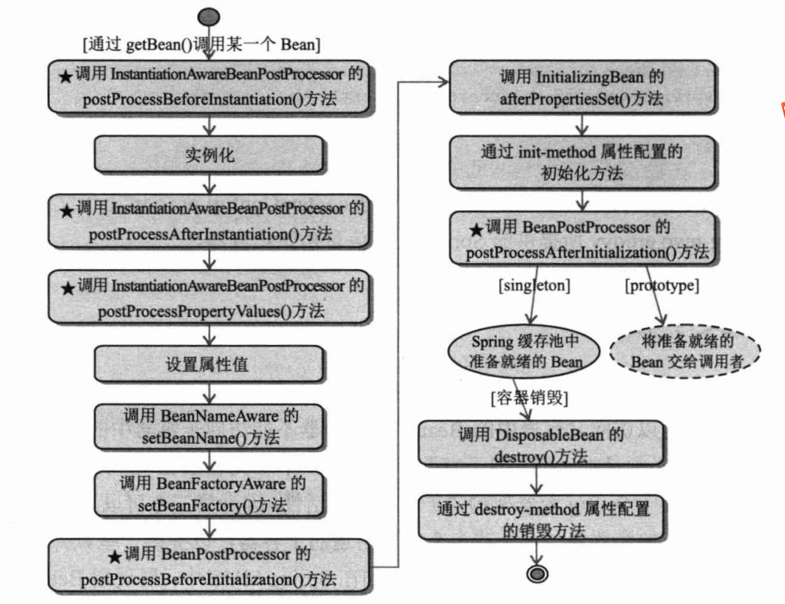
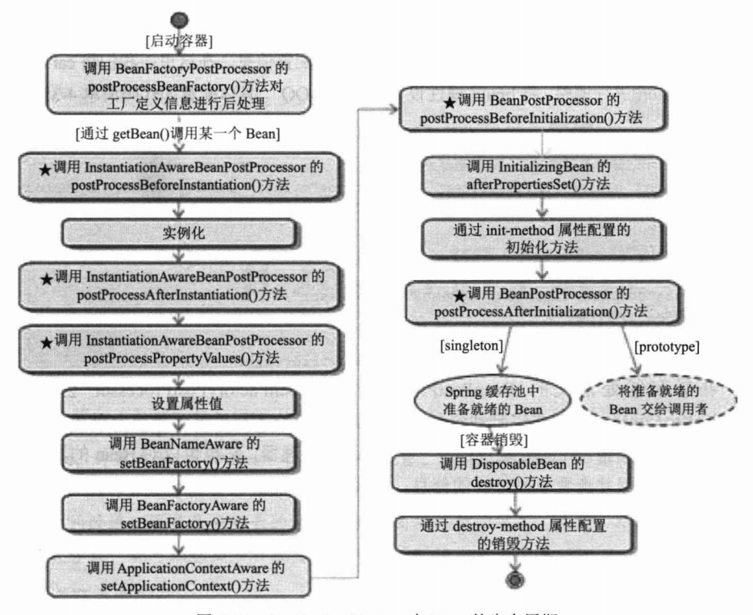

<!-- MarkdownTOC -->

- [Spring](#spring)
    + [IoC](#ioc)
    + [bean 的创建和销毁](#bean-的创建和销毁)
    + [依赖注入的两种方式](#依赖注入的两种方式)
    + [Spring 中 IOC 的实现原理](#spring-中-ioc-的实现原理)
    + [IoC 容器的初始化](#ioc-容器的初始化)
    + [AOP](#aop)
        * [切入点表达式](#切入点表达式)
    + [bean 的生命周期](#bean-的生命周期)
    + [spring 三级缓存](#spring-三级缓存)
    + [事务](#事务)
    + [Spring 中用到的设计模式](#spring-中用到的设计模式)
    + [Spring 的思维导图](#spring-的思维导图)
- [SpringMVC](#springmvc)
    + [SpringMVC源码解读](#springmvc源码解读)

<!-- /MarkdownTOC -->

# Spring

## IoC

**1.IoC 是什么**

IoC—Inversion of Control，即“控制反转”，不是什么技术，而是一种设计思想。在 Java 开发中，IoC 意味着将你设计好的对象交给容器控制，而不是传统的在你的对象内部直接控制。如何理解好Ioc呢？理解好 IoC 的关键是要明确“谁控制谁，控制什么，为何是反转（有反转就应该有正转了），哪些方面反转了”，那我们来深入分析一下：

　　**谁控制谁，控制什么**：传统 Java SE 程序设计，我们直接在对象内部通过 new 进行创建对象，是程序主动去创建依赖对象；而 IoC 是有专门一个容器来创建这些对象，即由 IoC 容器来控制对 象的创建；谁控制谁？当然是 IoC 容器控制了对象；控制什么？那就是主要控制了外部资源获取(不只是对象包括比如文件等)。

　　**为何是反转，哪些方面反转了**：有反转就有正转，传统应用程序是由我们自己在对象中主动控制去直接获取依赖对象，也就是正转；而反转则是由容器来帮忙创建及注入依赖对象；为何是反转？因为由容器帮我们查找及注入依赖对象，对象只是被动的接受依赖对象，所以是反转；哪些方面反转了？依赖对象的获取被反转了。

用图例说明一下，传统程序设计如图1，都是主动去创建相关对象然后再组合起来：

<div align="center">  </div> 
<div align="center"> 图1 传统应用程序示意图 </div> <br>
当有了 IoC/DI 的容器后，在客户端类中不再主动去创建这些对象了，如图2所示:

<div align="center">  </div>
<div align="center"> 图2 有IoC/DI容器后程序结构示意图 </div> <br>

**2.IoC 能做什么**

IoC 不是一种技术，只是一种思想，一个重要的面向对象编程的法则，它能指导我们如何设计出松耦合、更优良的程序。传统应用程序都是由我们在类内部主动创建依赖对象，从而导致类与类之间高耦合，难于测试；有了 IoC 容器后，把创建和查找依赖对象的控制权交给了容器，由容器进行注入组合对象，所以对象与对象之间是松散耦合，这样也方便测试，利于功能复用，更重要的是使得程序的整个体系结构变得非常灵活。

其实IoC对编程带来的最大改变不是从代码上，而是从思想上，发生了“主从换位”的变化。应用程序原本是老大，要获取什么资源都是主动出击，但是在 IoC/DI 思想中，应用程序就变成被动的了，被动的等待IoC容器来创建并注入它所需要的资源了。

IoC 很好的体现了面向对象设计法则之一—— 好莱坞法则：“别找我们，我们找你”；即由 IoC容器帮对象找相应的依赖对象并注入，而不是由对象主动去找。

 
**3.IoC 和 DI**

DI—Dependency Injection，即“依赖注入”：是组件之间依赖关系由容器在运行期决定，形象的说，即由容器动态的将某个依赖关系注入到组件之中。依赖注入的目的并非为软件系统带来更多功能，而是为了提升组件重用的频率，并为系统搭建一个灵活、可扩展的平台。通过依赖注入机制，我们只需要通过简单的配置，而无需任何代码就可指定目标需要的资源，完成自身的业务逻辑，而不需要关心具体的资源来自何处，由谁实现。

理解 DI 的关键是：“谁依赖谁，为什么需要依赖，谁注入谁，注入了什么”，那我们来深入分析一下：

* 谁依赖于谁：当然是应用程序依赖于 IoC 容器；

* 为什么需要依赖：应用程序需要 IoC 容器来提供对象需要的外部资源；

* 谁注入谁：很明显是 IoC 容器注入应用程序某个对象，应用程序依赖的对象；

* 注入了什么：就是注入某个对象所需要的外部资源（包括对象、资源、常量数据）。

 

IoC 和 DI 由什么关系呢？其实它们是同一个概念的不同角度描述，由于控制反转概念比较含糊（可能只是理解为容器控制对象这一个层面，很难让人想到谁来维护对象关系），所以 2004 年大师级人物 Martin Fowler 又给出了一个新的名字：“依赖注入”，相对 IoC 而言，“依赖注入”明确描述了“被注入对象依赖 IoC 容器配置依赖对象”。

## bean 的创建和销毁

```
public class UserServiceImpl implements UserService {
    
    public void myInit() {
        System.out.println("初始化");
    }
    
    public void myDestory() {
        System.out.println("销毁");
    }
    @Override
    public void addUser() {
        System.out.println("a_ioc add user");
    }
}
```

配置文件中配置 bean 的初始化和销毁方法，其中初始化方法用来准备数据等，销毁方法用来清理资源等，对象销毁必须关闭容器 (ClassPathXmlApplicationContext.close())，而且这个 bean 的 scope 必须是 singleton 不能是 prototype 
```
<bean id="userServiceId" class="com.itheima.a_ioc.UserServiceImpl" init-method="myInit" destroy-method="myDestory"></bean>
```

## 依赖注入的两种方式

1.属性注入

将要注入的属性 xxx 通过设置 setXxx() 方法进行注入，Spring 是通过 setXxx() 这个方法去找对应的属性的，这个属性可以不存在，但是在配置文件中，property 中的 name 必须和 set 方法中的一致

```
public class BookServiceImpl implements BookService {
    //需要注入的属性 1
    private BookDao bookDao;
    //需要注入的属性 2
    private String name;
    //对应的 set 方法
    public void setBookDao(BookDao bookDao) {
        this.bookDao = bookDao;
    }
    public void setName(String name) {
        this.name = name;
    }
}
```

配置文件；
```
<bean id="bookServiceId" class="com.itheima.b_di.BookServiceImpl">
    <property name="bookDao" ref="bookDaoId"></property>
    <property name="name" value="WeBank"></property>
<bean id="bookDaoId" class="com.itheima.b_di.BookDaoImpl"></bean>
```

2.构造方法注入

使用构造方法注入的前提是：bean 必须提供带参的构造方法

配置文件有以下几种配置方式：

*按类型匹配入参
*按索引匹配入参
*联合使用类型和索引匹配入参
*通过自身类型反射入参

```
public class BookServiceImpl implements BookService {

    private BookDao bookDao;
    private String name;
    
    public BookServiceImpl(BookDao bookDao, String name) {
        this.bookDao = bookDao;
        this.name = name;
    }
}
```

1.按照类型匹配入参方式
```
<bean id="bookServiceId" class="com.itheima.b_di.BookServiceImpl">
    <constructor-arg type="BookDao" ref="bookDaoId"></constructor-arg>
    <constructor-arg type="String" value="WeBank"></constructor-arg>
</bean>
```
2.按照索引匹配入参方式
```
<bean id="bookServiceId" class="com.itheima.b_di.BookServiceImpl">
    <constructor-arg index="0" ref="bookDaoId"></constructor-arg>
    <constructor-arg index="1" value="WeBank"></constructor-arg>
</bean>
```
注意：按照索引匹配入参的方式，如果有多个构造器，使用的是第一个构造器
3.联合使用类型和索引匹配入参
```
<bean id="bookServiceId" class="com.itheima.b_di.BookServiceImpl">
    <constructor-arg index="0" type="BookDao" ref="bookDaoId"></constructor-arg>
    <constructor-arg index="1" type="String" value="WeBank"></constructor-arg>
</bean>
```
4.通过自身类型反射入参
```
<bean id="bookServiceId" class="com.itheima.b_di.BookServiceImpl">
    <constructor-arg ref="bookDaoId"></constructor-arg>
    <constructor-arg value="WeBank"></constructor-arg>
</bean>
```
如果 bean 构造函数入参的类型是可辨别的，由于 Java 反射机制可以获取构造函数入参的类型，即使构造函数的注入不提供类型和索引的信息，Spring 依旧可以完成构造函数信息的注入

通过构造方法注入和属性注入都会出现循环依赖的情况，只是属性注入情况复杂一些
```
<bean id="bookServiceId" class="com.itheima.b_di.BookServiceImpl" scope="prototype">
    <property name="bookDao" ref="bookDaoId"></property>
</bean>
<bean id="bookDaoId" class="com.itheima.b_di.BookDaoImpl" scope="prototype">
    <property name="bookService" ref="bookServiceId"></property>
</bean>
```

属性注入的几种情况：

1.两个都是单例，创建对象成功

2.两个都是多例，创建对象失败

3.bookServiceId 是单例，bookDaoId 是多例，成功

4.bookServiceId 是多例，bookDaoId 是多例，失败

如果一个是单例，一个是 prototype，那么一定要保证单例对象能提前暴露出来，才可以正常注入属性。原因就是容器在创建对象的过程中，如果是单例的而且有无参的构造方法会直接创建，并把对象暴露出来，然后再完成属性注入。


## Spring 中 IOC 的实现原理

参考博客1：https://blog.csdn.net/jiangyu1013/article/details/72654373

参考博客2：https://blog.csdn.net/fuzhongmin05/article/details/61614873/

## IoC 容器的初始化

1.Resource定位 （Bean 的定义文件定位）

2.将 Resource 定位好的文件载入到BeanDefinition

BeanDefinitionReader 读取、解析 Resource 定位的资源，也就是将用户定义好的 Bean 表示成 IOC 容器的内部数据结构也就是 BeanDefinition， 配置文件中的每一个 <bean> 都对应着一个 BeanDefinition 对象，IoC 容器中是通过 HashMap < id, BeanDefinition > 来存储的
    
3.将 BeanDefinition 注册到容器中

向IOC容器注册这些 BeanDefinition，这个过程是通过 BeanDefinitionRegistery 接口来实现的，将每一个 <bean> 对应的 BeanDefinition 对象注入到 HashMap < id, BeanDefinition > 容器中
    
**注意**：这时候并没有完成依赖注入，依赖的注入是在 getBean() 时候完成。对某个 Bean 设置 lazyinit 属性，那么这个 Bean 的依赖注入就会在容器初始化的时候完成

参考博客：https://www.cnblogs.com/chenjunjie12321/p/6124649.html

## AOP

AOP-Aspect Oriented Programming，面向切面编程。要理解面向切面编程，首先我们回顾一下之前我们通过抽取出父类的这种纵向继承的方式，来减少重复的代码。比如，Horse, Pig, Camel 这些对象都有 run() 和 eat() 方法，通过引入一个包含这两个方法的抽象的 Animal 父类，Horse, Pig, Camel 这些对象就可以通过继承 Animal 复用 run() 和 eat() 方法。但是有些情况下，我们是没法通过抽取出父类的这种纵向的方式来实现代码的复用的。例如下面的这段代码：

<div align="center">  </div> 

上图的代码中，斜体的是方法性能监视代码，它在方法调用前启动，在方法调用返回前结束，并在内部记录性能监视的结果。而灰色的粗体代码是，事务开启和事务提交的代码。①和②处的逻辑代码淹没在这些代码中。

可以看出来，我们无法通过抽象父类的方式消除如上所示的重复性横切代码，因为这些横切逻辑依附在业务类方法的流程中，不能转移到其他地方去。

AOP 就是将分散在各个业务逻辑代码中相同代码，通过横向切割的方式抽取到一个独立的模块中。

1.AOP 中的专业术语


* 连接点

就是程序执行过程中某个特定的位置，比如类初始化之前、类初始化后、类的某个方法调用前/调用后，方法抛出异常后。Spring 仅支持方法的连接点，即只能在方法调用前、方法调用后、方法抛出异常后和方法调用前后这些程序执行点织入增强。

* 切点

就是程序中某些特定的方法，AOP 通过切点定位到连接点。

* 增强

就是织入到目标类连接点上的一段代码，英文为Advice，也叫通知。

* 目标类

就是增强逻辑要织入的目标类

* 引介

是一种特殊的增强，它为类添加一些属性和方法

* 织入

织入就是将增强，添加到目标类的具体连接点上的过程。

* 代理

一个类被 AOP 织入增强后，就产生了一个结果类，它是融合了原类和增强逻辑的代理类。Spring AOP 使用动态代理技术 (JDK 动态代理和 CGLIB 动态代理) 在程序运行期间织入增强的代码。

2.Spring AOP的两种动态代理示例

(1) JDK 动态代理

<div align="center">  </div> 
<div align="center">  </div> 
<div align="center">  </div> 

(2) CGLIB 动态代理

<div align="center">  </div> 
<div align="center">  </div> 

### 切入点表达式

\* 匹配任意数量的字符

\+ 匹配指定的类和子类

\.. 匹配任意数量的子包和或参数

## bean 的生命周期

一、BeanFactory中Bean的生命周期

<div align="center">  </div> 
<div align="center"> 图3 BeanFactory中Bean的生命周期 </div> <br>
1. 调用者通过 getBean() 请求某一个 Bean，如果容器注册了 org.springframework.beans.factory.config.InstantiationAwareBeanPostProcessor 接口，那么在实例化 Bean 之前，将调用接口的 postProcessBeforeInstantiation() 方法<br>
2. 根据配置情况调用Bean构造函数或工厂方法实例化 Bean<br>
3. 如果 Bean 配置了属性信息，那么在实例化后将调用 Bean 的属性设置方法设置属性值<br>
4. 通过后处理器 BeanPostPorcessor 对 Bean 进行加工(AOP、动态代理)<br>
5. 执行属性中定义的(如果定义过这个方法) init-method 方法<br>
6. 容器关闭，触发对 Bean 后续生命周期的管理，如果 Bean 实现了 DisposableBean 接口，就调用 destory() 方法，释放资源，销毁 Bean

http://blog.51cto.com/wenshengzhu/1950146

二、ApplicationContext中Bean的生命周期

<div align="center">  </div> 
<div align="center"> 图4 ApplicationContext中Bean的生命周期 </div> <br>

## Spring 中的 xml 配置文件

Xml配置文件中导入其他配置文件

在 /WEB-INF/applicationContext.xml 配置应用服务去加载，可以在 applicationContext.xml 中用 import 引入其他的配置文件
```
<?xml version="1.0" encod工口g="gb2312"?>  
<!一指定Spring 配置文件的dtd>  
<!DOCTYPE beans PUBLIC "-IISPR工NGIIDTD BEANIIEN"  
''http://www.springframework.org/dtd/spring-beans.dtd''>  
<!-- Spring 配置文件的根元素->  
<beans>  
    <!--导入hibernate的配置文件 -->  
    <import resource="com/demo/res/hibernate.xml"/>  
    <!--导入多个bean配置文件 -->  
    <import resource="com/demo/res/bean1.xml"/>  
    <import resource="com/demo/res/bean2.xml"/>  
   
    <!-- 下面也可以再定义该文件的其他bean --〉  
    <bean id="bean1" class=". ..">  
    <bean id="bean2" class="...">  
</beans>  
```

## spring 三级缓存

为什么Sping不选择二级缓存方式, 而是要额外加一层缓存？

如果要使用二级缓存解决循环依赖, 意味着Bean在构造完后就创建代理对象, 这样违背了Spring设计原则. Spring结合AOP跟Bean的生命周期, 是在Bean创建完全之后通过

AnnotationAwareAspectJAutoProxyCreator这个后置处理器来完成的, 在这个后置处理的postProcessAfterInitialization方法中对初始化后的Bean完成AOP代理.

如果出现了循环依赖, 那没有办法, 只有给Bean先创建代理, 但是没有出现循环依赖的情况下, 设计之初就是让Bean在生命周期的最后一步完成代理而不是在实例化后就立马完成

代理那为什么Sping不选择二级缓存方式, 而是要额外加一层缓存？

如果要使用二级缓存解决循环依赖, 意味着Bean在构造完后就创建代理对象, 这样违背了Spring设计原则. Spring结合AOP跟Bean的生命周期, 是在Bean创建完全之后通过

AnnotationAwareAspectJAutoProxyCreator这个后置处理器来完成的, 在这个后置处理的postProcessAfterInitialization方法中对初始化后的Bean完成AOP代理.

如果出现了循环依赖, 那没有办法, 只有给Bean先创建代理, 但是没有出现循环依赖的情况下, 设计之初就是让Bean在生命周期的最后一步完成代理而不是在实例化后就立马完成代理


## 事务

spring中事务失效的场景:

(1)private方法增加事务注解, 事务注解修饰的方法一定是public的

(2)方法用final修饰

(3)方法内部调用, 加了事务注解的方法被其他方法直接调用, 相当于this.methodXXX(), 没有使用代理类, 所以事务无法生效

(4)未被spring管理的类, 方法上面的事务注解也不会生效

## Spring 中用到的设计模式

(1)工厂模式：Spring 中 bean 的创建，Spring 中对象的创建是通过反射创建的，所以在 xml 的配置中要配置 class ，也就是类的全限定名，这样才能正常加载这个类，并创建类对象

## Spring 的思维导图

我认为最简单的思维导图：https://juejin.im/entry/590c28fc128fe1005839311b

# SpringMVC

1.在 web.xml 中配置 Servlet
```
<!-- springmvc的前端控制器 -->
    <servlet>
    <!--配置一个叫做taotao-portal的Servlet，自动启动，然后mapping到所有的请求
        <servlet-name>taotao-portal</servlet-name>
        <servlet-class>org.springframework.web.servlet.DispatcherServlet</servlet-class>
        <!-- contextConfigLocation用来指定SpringMVC配置文件的位置， 如果不配置contextConfigLocation， springmvc的配置文件默认是：WEB-INF/servlet名字+"-servlet.xml" -->
        <init-param>
            <param-name>contextConfigLocation</param-name>
            <param-value>classpath:spring/springmvc.xml</param-value>
        </init-param>
        <load-on-startup>1</load-on-startup>
    </servlet>
    <servlet-mapping>
        <servlet-name>taotao-portal</servlet-name>
        <url-pattern>/</url-pattern>
    </servlet-mapping>
```

2.创建 SpringMVC 的 xml 配置文件
```
<?xml version="1.0" encoding="UTF-8"?>
<beans xmlns="http://www.springframework.org/schema/beans"
    xmlns:xsi="http://www.w3.org/2001/XMLSchema-instance" 
    xmlns:p="http://www.springframework.org/schema/p"
    xmlns:context="http://www.springframework.org/schema/context"
    xmlns:mvc="http://www.springframework.org/schema/mvc"
    xsi:schemaLocation="http://www.springframework.org/schema/beans 
        http://www.springframework.org/schema/beans/spring-beans.xsd
        http://www.springframework.org/schema/mvc 
        http://www.springframework.org/schema/mvc/spring-mvc-4.0.xsd
        http://www.springframework.org/schema/context 
        http://www.springframework.org/schema/context/spring-context.xsd">
</beans>
    <!-- 配置包扫描器 -->    
    <context:component-scan base-package="com.taotao.portal.controller"></context:component-scan>
    <!-- 配置注解驱动 -->
    <!-- 这是SpringMVC提供的一键式的配置方法，配置此标签后SpringMVC会帮我们自动做一些注册组件之类的事情 -->
    <mvc:annotation-driven/>
    <!-- 视图解析器 -->
    <bean
        class="org.springframework.web.servlet.view.InternalResourceViewResolver">
        <property name="prefix" value="/WEB-INF/jsp/" />
        <property name="suffix" value=".jsp" />
    </bean>
```

3.创建 controller 和 view

在 com.taotao.portal.controller 包下面创建带有 Controller 注解的类，在    WEN-INF 包下面创建对于的 jsp 页面作为视图

## Http 中的请求和响应的报文格式

1. Http 请求 (request)

```
POST /index.html HTTP/1.1
HOST: www.XXX.com
User-Agent: Mozilla/5.0(Windows NT 6.1;rv:15.0) Firefox/15.0

Username=admin&password=admin
```

2. Http 响应 (response)

```
HTTP/1.1 200 OK
Content-Encoding: gzip
Content-Type: text/html;charset=utf-8

<!DOCTYPE html>
<html lang="en">
<head>
    <meta charset="UTF-8" />
    <title>Document</title>
</head>
<body>
    <p>this is http response</p>
</body>
</html>
```

## SpringMVC 中的注解

1.RequestMapping

这个注解可以添加在方法上，也可以添加在类上。添加在类上表示类中所有响应请求的方法都是以该地址作为父路径，添加在方法上表示该地址将会访问到该方法

2.ResponseBody

添加 @ResponseBody 表示将方法的返回结果直接放在响应的方法体中，不然默认是寻找对应的 XXX.jsp 页面，如果方法上面不添加这个注解，而且也没有对应的XXX.jsp 页面，就会出现 404 (页面找不到) 的错误

3.RequestBody 

该注解是将请求正文插入方法中，使用适合的 HttpMessageConverter 将请求体写入对象

```
@RequestMapping(value = "person/login")
@ResponseBody
public Person login(@RequestBody Person person) {   // 将请求中的 datas 写入 Person 对象中
    return person;    // 不会被解析为跳转路径，而是直接写入 HTTP 响应正文中
}
```
4.PathVariable

这个注解用于动态的获取请求路径 (url) 中的动态参数

```
/**
* @RequestMapping(value = "/person/profile/{id}/{name}/{status}") 中的 {id}/{name}/{status}
* 与 @PathVariable int id、@PathVariable String name、@PathVariable boolean status
* 一一对应，按名匹配。
*/

@RequestMapping(value = "person/profile/{id}/{name}/{status}")
@ResponseBody
public Person porfile(@PathVariable int id, @PathVariable String name, @PathVariable boolean status) {
    return new Person(id, name, status);
}
```

## SpringMVC源码解读

参考博客：https://www.cnblogs.com/fangjian0423/p/springMVC-directory-summary.html
